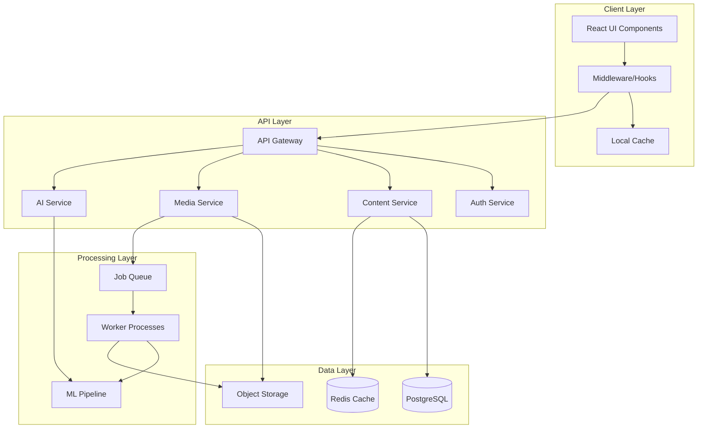

# Teacher Content Creation System - Architecture Overview

## System Architecture



## Core Design Principles

### 1. Modularity & Extensibility
- **Plugin Architecture**: Core system with pluggable content type modules
- **Strategy Pattern**: Different creation strategies for different content types
- **Event-Driven**: Loosely coupled components communicate via events

### 2. Scalability
- **Horizontal Scaling**: Stateless services that can be replicated
- **Caching Strategy**: Multi-layer caching (CDN, Redis, application)
- **Async Processing**: Heavy operations handled by background workers

### 3. Developer Experience
- **TypeScript First**: Full type safety across the stack
- **API-First Design**: Backend can support multiple frontends
- **Documentation**: Auto-generated API docs and component stories

## Component Architecture

### Frontend Architecture

```typescript
// Component hierarchy
src/
├── components/
│   ├── content-creation/
│   │   ├── core/
│   │   │   ├── ContentWizard.tsx
│   │   │   ├── StepManager.tsx
│   │   │   └── PreviewPane.tsx
│   │   ├── yoga-specific/
│   │   │   ├── PoseSequencer.tsx
│   │   │   ├── BreathingDesigner.tsx
│   │   │   ├── ChakraMapper.tsx
│   │   │   └── MusicCurator.tsx
│   │   └── shared/
│   │       ├── MediaUploader.tsx
│   │       ├── MetadataEditor.tsx
│   │       └── TagManager.tsx
│   ├── ui/
│   └── layouts/
├── hooks/
│   ├── useContentCreation.ts
│   ├── useMediaUpload.ts
│   └── useAutoSave.ts
├── services/
│   ├── content.service.ts
│   ├── media.service.ts
│   └── ai.service.ts
└── types/
    ├── content.types.ts
    └── api.types.ts
```

### State Management

```typescript
// Zustand store structure
interface ContentCreationStore {
  // Current content being created/edited
  currentContent: Partial<Content>;
  
  // UI state
  currentStep: number;
  validationErrors: ValidationError[];
  isDirty: boolean;
  
  // Actions
  updateField: (field: string, value: any) => void;
  validateStep: (step: number) => Promise<boolean>;
  saveDraft: () => Promise<void>;
  publish: () => Promise<void>;
  
  // Async operations
  uploadMedia: (file: File) => Promise<MediaAsset>;
  generateWithAI: (prompt: string) => Promise<void>;
}
```

### Backend Architecture

```typescript
// Service layer architecture
class ContentService {
  constructor(
    private db: Database,
    private cache: Cache,
    private events: EventEmitter,
    private validator: ContentValidator
  ) {}
  
  async create(data: CreateContentDTO): Promise<Content> {
    // Validate
    await this.validator.validate(data);
    
    // Process based on content type
    const processor = this.getProcessor(data.type);
    const processed = await processor.process(data);
    
    // Save to database
    const content = await this.db.content.create(processed);
    
    // Emit events
    this.events.emit('content.created', content);
    
    // Cache
    await this.cache.set(`content:${content.id}`, content);
    
    return content;
  }
  
  private getProcessor(type: ContentType): ContentProcessor {
    // Factory pattern for content processors
    return ProcessorFactory.create(type);
  }
}
```

## Data Architecture

### Database Schema Design

```sql
-- Core content table with JSONB for flexibility
CREATE TABLE content (
    id UUID PRIMARY KEY DEFAULT uuid_generate_v4(),
    teacher_id UUID NOT NULL REFERENCES users(id),
    type VARCHAR(50) NOT NULL,
    status VARCHAR(20) DEFAULT 'draft',
    
    -- Common fields as columns for indexing
    title VARCHAR(255) NOT NULL,
    slug VARCHAR(255) UNIQUE,
    description TEXT,
    thumbnail_url TEXT,
    
    -- Flexible JSONB fields
    metadata JSONB DEFAULT '{}',
    type_specific_data JSONB DEFAULT '{}',
    settings JSONB DEFAULT '{}',
    
    -- Timestamps
    created_at TIMESTAMP DEFAULT NOW(),
    updated_at TIMESTAMP DEFAULT NOW(),
    published_at TIMESTAMP,
    
    -- Search optimization
    search_vector tsvector GENERATED ALWAYS AS (
        setweight(to_tsvector('english', coalesce(title, '')), 'A') ||
        setweight(to_tsvector('english', coalesce(description, '')), 'B')
    ) STORED,
    
    -- Indexes
    INDEX idx_teacher_id (teacher_id),
    INDEX idx_type (type),
    INDEX idx_status (status),
    INDEX idx_published_at (published_at),
    INDEX idx_search_vector USING GIN (search_vector)
);

-- Media assets table
CREATE TABLE media_assets (
    id UUID PRIMARY KEY DEFAULT uuid_generate_v4(),
    content_id UUID REFERENCES content(id) ON DELETE CASCADE,
    type VARCHAR(50) NOT NULL, -- 'video', 'audio', 'image'
    url TEXT NOT NULL,
    thumbnail_url TEXT,
    duration_seconds INTEGER,
    file_size_bytes BIGINT,
    metadata JSONB DEFAULT '{}',
    processing_status VARCHAR(20) DEFAULT 'pending',
    created_at TIMESTAMP DEFAULT NOW()
);

-- Content relationships for programs and series
CREATE TABLE content_relationships (
    id UUID PRIMARY KEY DEFAULT uuid_generate_v4(),
    parent_id UUID REFERENCES content(id) ON DELETE CASCADE,
    child_id UUID REFERENCES content(id) ON DELETE CASCADE,
    relationship_type VARCHAR(50), -- 'contains', 'prerequisite', 'related'
    sequence_order INTEGER,
    metadata JSONB DEFAULT '{}',
    UNIQUE(parent_id, child_id, relationship_type)
);

-- Pose library
CREATE TABLE poses (
    id UUID PRIMARY KEY DEFAULT uuid_generate_v4(),
    name_english VARCHAR(255) NOT NULL,
    name_sanskrit VARCHAR(255),
    category VARCHAR(100),
    difficulty VARCHAR(20),
    focus_areas TEXT[],
    benefits TEXT[],
    contraindications TEXT[],
    instructions JSONB,
    thumbnail_url TEXT,
    created_at TIMESTAMP DEFAULT NOW()
);

-- Sequences linking poses to content
CREATE TABLE pose_sequences (
    id UUID PRIMARY KEY DEFAULT uuid_generate_v4(),
    content_id UUID REFERENCES content(id) ON DELETE CASCADE,
    sequence_order INTEGER NOT NULL,
    pose_id UUID REFERENCES poses(id),
    duration_seconds INTEGER,
    transition_notes TEXT,
    modifications JSONB,
    UNIQUE(content_id, sequence_order)
);
```

### Data Flow Architecture

```typescript
// Data flow for content creation
interface DataFlow {
  // 1. Input validation
  validation: {
    client: 'Zod schemas for form validation',
    server: 'Joi validation for API requests',
    business: 'Domain-specific rules'
  };
  
  // 2. Processing pipeline
  processing: {
    media: 'Upload → Validate → Process → Store → CDN',
    content: 'Create → Enrich → Index → Cache → Return',
    async: 'Queue → Worker → Process → Notify'
  };
  
  // 3. Storage strategy
  storage: {
    hot: 'Redis for active sessions and drafts',
    warm: 'PostgreSQL for content and metadata',
    cold: 'S3 for media files and archives'
  };
  
  // 4. Retrieval optimization
  retrieval: {
    cache: 'CDN → Redis → Database',
    search: 'Elasticsearch for full-text search',
    recommendations: 'ML model for content suggestions'
  };
}
```

## API Architecture

### RESTful Endpoints

```typescript
// Content API endpoints
const contentAPI = {
  // CRUD operations
  'POST   /api/content': 'Create new content',
  'GET    /api/content/:id': 'Get content by ID',
  'PUT    /api/content/:id': 'Update content',
  'DELETE /api/content/:id': 'Delete content',
  'GET    /api/content': 'List content with filters',
  
  // Status management
  'POST   /api/content/:id/publish': 'Publish content',
  'POST   /api/content/:id/unpublish': 'Unpublish content',
  'POST   /api/content/:id/archive': 'Archive content',
  
  // Media operations
  'POST   /api/content/:id/media': 'Upload media',
  'DELETE /api/content/:id/media/:mediaId': 'Delete media',
  
  // Relationships
  'POST   /api/content/:id/relationships': 'Add relationship',
  'DELETE /api/content/:id/relationships/:relId': 'Remove relationship',
  
  // AI operations
  'POST   /api/content/generate': 'Generate with AI',
  'POST   /api/content/:id/enhance': 'Enhance with AI',
  'POST   /api/content/:id/validate': 'Validate safety'
};

// Media API endpoints
const mediaAPI = {
  'POST   /api/media/upload': 'Initialize upload',
  'POST   /api/media/chunk': 'Upload chunk',
  'POST   /api/media/complete': 'Complete upload',
  'GET    /api/media/:id/status': 'Get processing status',
  'POST   /api/media/:id/transcode': 'Request transcoding'
};
```

### GraphQL Schema (Alternative)

```graphql
type Content {
  id: ID!
  type: ContentType!
  title: String!
  description: String
  status: ContentStatus!
  teacher: Teacher!
  media: [MediaAsset!]
  metadata: JSON
  typeSpecificData: JSON
  createdAt: DateTime!
  updatedAt: DateTime!
  publishedAt: DateTime
}

type Query {
  content(id: ID!): Content
  contents(
    filter: ContentFilter
    sort: ContentSort
    pagination: PaginationInput
  ): ContentConnection!
  
  myContent(
    status: ContentStatus
    type: ContentType
  ): [Content!]!
}

type Mutation {
  createContent(input: CreateContentInput!): Content!
  updateContent(id: ID!, input: UpdateContentInput!): Content!
  deleteContent(id: ID!): Boolean!
  publishContent(id: ID!): Content!
  
  uploadMedia(contentId: ID!, file: Upload!): MediaAsset!
  generateContent(prompt: String!, type: ContentType!): Content!
}

type Subscription {
  contentProcessing(id: ID!): ProcessingStatus!
  mediaUploadProgress(id: ID!): UploadProgress!
}
```

## Security Architecture

### Authentication & Authorization

```typescript
// Role-based access control
const permissions = {
  teacher: {
    content: ['create', 'read:own', 'update:own', 'delete:own'],
    media: ['upload', 'read:own', 'delete:own'],
    analytics: ['read:own']
  },
  
  admin: {
    content: ['create', 'read', 'update', 'delete'],
    media: ['upload', 'read', 'delete'],
    analytics: ['read'],
    users: ['read', 'update', 'delete']
  },
  
  student: {
    content: ['read:published'],
    media: ['read:published'],
    analytics: []
  }
};

// Middleware for route protection
const authMiddleware = {
  authenticate: 'Verify JWT token',
  authorize: 'Check role permissions',
  rateLimit: 'Prevent abuse',
  sanitize: 'Clean input data',
  audit: 'Log all actions'
};
```

### Data Security

```typescript
// Security measures
const security = {
  // Encryption
  encryption: {
    atRest: 'AES-256 for database',
    inTransit: 'TLS 1.3 for all connections',
    keys: 'AWS KMS for key management'
  },
  
  // Input validation
  validation: {
    xss: 'DOMPurify for user content',
    sql: 'Parameterized queries only',
    files: 'Magic number validation',
    size: 'Strict file size limits'
  },
  
  // Access control
  access: {
    cors: 'Whitelist allowed origins',
    csrf: 'Token-based protection',
    headers: 'Security headers (CSP, HSTS)',
    firewall: 'WAF rules'
  }
};
```

## Performance Architecture

### Optimization Strategies

```typescript
// Performance optimizations
const optimizations = {
  // Frontend
  frontend: {
    bundling: 'Code splitting by route',
    images: 'Next.js Image with optimization',
    lazy: 'Lazy load non-critical components',
    prefetch: 'Prefetch likely next steps'
  },
  
  // Backend
  backend: {
    queries: 'Query optimization and indexing',
    caching: 'Multi-layer caching strategy',
    pooling: 'Connection pooling',
    batching: 'DataLoader for GraphQL'
  },
  
  // Media
  media: {
    cdn: 'CloudFlare for global distribution',
    formats: 'WebP/AVIF for images, HLS for video',
    responsive: 'Multiple resolutions',
    compression: 'Optimal quality/size balance'
  }
};
```

### Monitoring & Observability

```typescript
// Monitoring setup
const monitoring = {
  // Application monitoring
  apm: {
    tool: 'Sentry',
    metrics: ['errors', 'performance', 'transactions']
  },
  
  // Infrastructure monitoring
  infrastructure: {
    tool: 'Prometheus + Grafana',
    metrics: ['cpu', 'memory', 'disk', 'network']
  },
  
  // Business metrics
  analytics: {
    tool: 'Custom dashboard',
    metrics: ['content created', 'upload success', 'publish rate']
  },
  
  // Logging
  logging: {
    tool: 'ELK Stack',
    levels: ['error', 'warn', 'info', 'debug'],
    structured: true
  }
};
```

## Deployment Architecture

### Infrastructure as Code

```yaml
# Docker Compose for development
version: '3.8'
services:
  app:
    build: .
    ports:
      - "3000:3000"
    environment:
      - DATABASE_URL=postgresql://...
      - REDIS_URL=redis://redis:6379
    depends_on:
      - postgres
      - redis
      
  postgres:
    image: postgres:15
    volumes:
      - postgres_data:/var/lib/postgresql/data
    environment:
      - POSTGRES_DB=dzenyoga
      - POSTGRES_PASSWORD=secure_password
      
  redis:
    image: redis:7-alpine
    volumes:
      - redis_data:/data
      
  minio:
    image: minio/minio
    command: server /data
    volumes:
      - minio_data:/data
    environment:
      - MINIO_ROOT_USER=admin
      - MINIO_ROOT_PASSWORD=secure_password

volumes:
  postgres_data:
  redis_data:
  minio_data:
```

### Production Deployment

```typescript
// Deployment configuration
const deployment = {
  // Hosting
  hosting: {
    frontend: 'Vercel',
    backend: 'Railway/Render',
    database: 'Supabase',
    storage: 'Supabase Storage + CloudFlare R2'
  },
  
  // CI/CD
  cicd: {
    pipeline: 'GitHub Actions',
    stages: ['lint', 'test', 'build', 'deploy'],
    environments: ['dev', 'staging', 'production']
  },
  
  // Scaling
  scaling: {
    strategy: 'Horizontal autoscaling',
    metrics: 'CPU > 70% or Memory > 80%',
    min: 2,
    max: 10
  }
};
```

## Migration Strategy

### From Existing System

```typescript
// Migration plan
const migration = {
  // Phase 1: Parallel run
  phase1: {
    duration: '2 weeks',
    approach: 'New system alongside old',
    data: 'Read from old, write to both'
  },
  
  // Phase 2: Gradual migration
  phase2: {
    duration: '4 weeks',
    approach: 'Feature flag controlled',
    data: 'Batch migration of content'
  },
  
  // Phase 3: Cutover
  phase3: {
    duration: '1 week',
    approach: 'Full switch to new system',
    data: 'Final sync and validation'
  }
};
```

## Future Considerations

### Planned Enhancements

1. **Real-time Collaboration**
   - WebRTC for co-teaching
   - Collaborative editing
   - Live annotations

2. **Advanced AI Features**
   - Pose detection from video
   - Automatic captioning
   - Voice cloning for multiple languages

3. **Blockchain Integration**
   - NFT certificates
   - Decentralized content storage
   - Smart contracts for royalties

4. **Mobile Native Apps**
   - React Native implementation
   - Offline content creation
   - Mobile-specific optimizations

This architecture provides a solid foundation for building a scalable, maintainable, and feature-rich teacher content creation system while maintaining flexibility for future enhancements.