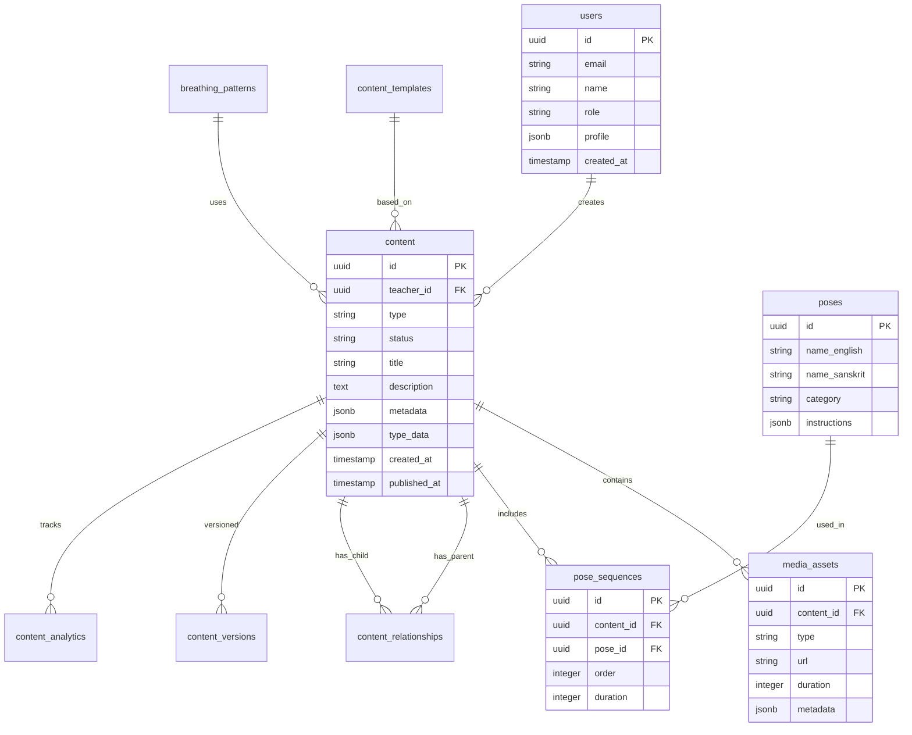

# Teacher Content Creation System - Database Schema Documentation

## Overview

This document details the database schema for the teacher content creation system. The design emphasizes flexibility through JSONB fields while maintaining queryable structured data for performance.

## Entity Relationship Diagram



## Core Tables

### 1. Content Table

The central table storing all content types with flexible JSONB fields for type-specific data.

```sql
CREATE TABLE content (
    -- Primary identification
    id UUID PRIMARY KEY DEFAULT uuid_generate_v4(),
    teacher_id UUID NOT NULL REFERENCES users(id) ON DELETE CASCADE,
    
    -- Content type and status
    type VARCHAR(50) NOT NULL CHECK (type IN (
        'class', 'breathing', 'asana', 'quick_flow', 
        'challenge', 'meditation', 'live_class', 
        'workshop', 'program'
    )),
    status VARCHAR(20) NOT NULL DEFAULT 'draft' CHECK (status IN (
        'draft', 'review', 'published', 'archived', 'deleted'
    )),
    
    -- Basic information (indexed for search)
    title VARCHAR(255) NOT NULL,
    slug VARCHAR(255) UNIQUE,
    description TEXT,
    thumbnail_url TEXT,
    
    -- Categorization
    difficulty VARCHAR(20) CHECK (difficulty IN (
        'beginner', 'intermediate', 'advanced', 'all_levels'
    )),
    duration_minutes INTEGER,
    language VARCHAR(10) DEFAULT 'en',
    
    -- Flexible metadata storage
    metadata JSONB DEFAULT '{}' NOT NULL,
    type_specific_data JSONB DEFAULT '{}' NOT NULL,
    settings JSONB DEFAULT '{}' NOT NULL,
    tags TEXT[] DEFAULT '{}',
    
    -- Monetization
    pricing_type VARCHAR(20) DEFAULT 'free' CHECK (pricing_type IN (
        'free', 'paid', 'subscription', 'donation'
    )),
    price_amount DECIMAL(10, 2),
    price_currency VARCHAR(3) DEFAULT 'USD',
    
    -- Timestamps
    created_at TIMESTAMP WITH TIME ZONE DEFAULT NOW(),
    updated_at TIMESTAMP WITH TIME ZONE DEFAULT NOW(),
    published_at TIMESTAMP WITH TIME ZONE,
    scheduled_for TIMESTAMP WITH TIME ZONE,
    expires_at TIMESTAMP WITH TIME ZONE,
    
    -- Full-text search
    search_vector tsvector GENERATED ALWAYS AS (
        setweight(to_tsvector('english', coalesce(title, '')), 'A') ||
        setweight(to_tsvector('english', coalesce(description, '')), 'B') ||
        setweight(to_tsvector('english', coalesce(array_to_string(tags, ' '), '')), 'C')
    ) STORED
);

-- Indexes for performance
CREATE INDEX idx_content_teacher_id ON content(teacher_id);
CREATE INDEX idx_content_type ON content(type);
CREATE INDEX idx_content_status ON content(status);
CREATE INDEX idx_content_published_at ON content(published_at) WHERE status = 'published';
CREATE INDEX idx_content_difficulty ON content(difficulty);
CREATE INDEX idx_content_language ON content(language);
CREATE INDEX idx_content_tags ON content USING GIN(tags);
CREATE INDEX idx_content_search ON content USING GIN(search_vector);
CREATE INDEX idx_content_metadata ON content USING GIN(metadata);
CREATE INDEX idx_content_slug ON content(slug);

-- Trigger to update updated_at
CREATE OR REPLACE FUNCTION update_updated_at_column()
RETURNS TRIGGER AS $$
BEGIN
    NEW.updated_at = NOW();
    RETURN NEW;
END;
$$ language 'plpgsql';

CREATE TRIGGER update_content_updated_at BEFORE UPDATE
    ON content FOR EACH ROW EXECUTE FUNCTION update_updated_at_column();
```

### 2. Media Assets Table

Stores all media files associated with content.

```sql
CREATE TABLE media_assets (
    id UUID PRIMARY KEY DEFAULT uuid_generate_v4(),
    content_id UUID REFERENCES content(id) ON DELETE CASCADE,
    
    -- Media information
    type VARCHAR(20) NOT NULL CHECK (type IN (
        'video', 'audio', 'image', 'document', 'subtitle'
    )),
    purpose VARCHAR(50), -- 'main', 'thumbnail', 'preview', 'supplement'
    
    -- File information
    url TEXT NOT NULL,
    cdn_url TEXT,
    thumbnail_url TEXT,
    filename VARCHAR(255),
    mime_type VARCHAR(100),
    file_size_bytes BIGINT,
    
    -- Media metadata
    duration_seconds INTEGER,
    width INTEGER,
    height INTEGER,
    bitrate INTEGER,
    format VARCHAR(20),
    
    -- Processing
    processing_status VARCHAR(20) DEFAULT 'pending' CHECK (processing_status IN (
        'pending', 'processing', 'completed', 'failed'
    )),
    processing_error TEXT,
    processing_metadata JSONB DEFAULT '{}',
    
    -- Additional data
    metadata JSONB DEFAULT '{}',
    transcription TEXT, -- For audio/video
    alt_text TEXT, -- For images
    
    -- Timestamps
    created_at TIMESTAMP WITH TIME ZONE DEFAULT NOW(),
    processed_at TIMESTAMP WITH TIME ZONE,
    
    -- Ordering
    display_order INTEGER DEFAULT 0
);

CREATE INDEX idx_media_content_id ON media_assets(content_id);
CREATE INDEX idx_media_type ON media_assets(type);
CREATE INDEX idx_media_processing_status ON media_assets(processing_status);
CREATE INDEX idx_media_purpose ON media_assets(purpose);
```

### 3. Poses Library Table

Comprehensive pose database for yoga content.

```sql
CREATE TABLE poses (
    id UUID PRIMARY KEY DEFAULT uuid_generate_v4(),
    
    -- Naming
    name_english VARCHAR(255) NOT NULL,
    name_sanskrit VARCHAR(255),
    name_translations JSONB DEFAULT '{}', -- {"es": "...", "ru": "..."}
    aliases TEXT[] DEFAULT '{}',
    
    -- Categorization
    category VARCHAR(100) NOT NULL, -- 'standing', 'seated', 'prone', etc.
    sub_category VARCHAR(100),
    difficulty VARCHAR(20) NOT NULL CHECK (difficulty IN (
        'beginner', 'intermediate', 'advanced'
    )),
    
    -- Physical aspects
    focus_areas TEXT[] DEFAULT '{}', -- ['hips', 'shoulders', 'core']
    muscle_groups TEXT[] DEFAULT '{}',
    joint_actions JSONB DEFAULT '{}',
    
    -- Benefits and warnings
    benefits TEXT[] DEFAULT '{}',
    contraindications TEXT[] DEFAULT '{}',
    modifications JSONB DEFAULT '{}', -- Variations for different needs
    props TEXT[] DEFAULT '{}',
    
    -- Instructions
    instructions JSONB DEFAULT '{}', -- Step-by-step guide
    alignment_cues TEXT[] DEFAULT '{}',
    common_mistakes TEXT[] DEFAULT '{}',
    
    -- Media
    thumbnail_url TEXT,
    image_urls JSONB DEFAULT '{}', -- Multiple angles
    video_url TEXT,
    
    -- Metadata
    chakras TEXT[] DEFAULT '{}',
    doshas TEXT[] DEFAULT '{}',
    elements TEXT[] DEFAULT '{}',
    breath_pattern VARCHAR(100),
    
    -- Search and display
    tags TEXT[] DEFAULT '{}',
    is_active BOOLEAN DEFAULT true,
    created_at TIMESTAMP WITH TIME ZONE DEFAULT NOW(),
    updated_at TIMESTAMP WITH TIME ZONE DEFAULT NOW()
);

CREATE INDEX idx_poses_category ON poses(category);
CREATE INDEX idx_poses_difficulty ON poses(difficulty);
CREATE INDEX idx_poses_focus_areas ON poses USING GIN(focus_areas);
CREATE INDEX idx_poses_name ON poses(name_english);
CREATE INDEX idx_poses_sanskrit ON poses(name_sanskrit);
CREATE UNIQUE INDEX idx_poses_name_unique ON poses(LOWER(name_english));
```

### 4. Pose Sequences Table

Links poses to content in a specific order.

```sql
CREATE TABLE pose_sequences (
    id UUID PRIMARY KEY DEFAULT uuid_generate_v4(),
    content_id UUID NOT NULL REFERENCES content(id) ON DELETE CASCADE,
    
    -- Sequence information
    sequence_order INTEGER NOT NULL,
    pose_id UUID REFERENCES poses(id),
    custom_pose_name VARCHAR(255), -- For poses not in library
    
    -- Timing
    duration_seconds INTEGER NOT NULL,
    breath_count INTEGER,
    hold_time_seconds INTEGER,
    
    -- Transitions
    transition_in VARCHAR(255),
    transition_out VARCHAR(255),
    transition_notes TEXT,
    
    -- Instructions
    instruction_override TEXT, -- Custom instructions for this instance
    verbal_cues TEXT[] DEFAULT '{}',
    modification_notes TEXT,
    
    -- Sides (for asymmetric poses)
    side VARCHAR(20) CHECK (side IN ('left', 'right', 'both', 'center')),
    
    -- Metadata
    intensity_level INTEGER CHECK (intensity_level BETWEEN 1 AND 10),
    is_rest_pose BOOLEAN DEFAULT false,
    is_peak_pose BOOLEAN DEFAULT false,
    
    created_at TIMESTAMP WITH TIME ZONE DEFAULT NOW(),
    
    UNIQUE(content_id, sequence_order)
);

CREATE INDEX idx_sequences_content_id ON pose_sequences(content_id);
CREATE INDEX idx_sequences_pose_id ON pose_sequences(pose_id);
CREATE INDEX idx_sequences_order ON pose_sequences(content_id, sequence_order);
```

### 5. Breathing Patterns Table

Stores breathing exercise patterns.

```sql
CREATE TABLE breathing_patterns (
    id UUID PRIMARY KEY DEFAULT uuid_generate_v4(),
    
    -- Pattern identification
    name VARCHAR(255) NOT NULL,
    tradition VARCHAR(100), -- 'pranayama', 'wim_hof', etc.
    
    -- Pattern definition
    pattern_type VARCHAR(50) NOT NULL, -- 'ratio', 'counted', 'natural'
    inhale_duration INTEGER,
    hold_in_duration INTEGER,
    exhale_duration INTEGER,
    hold_out_duration INTEGER,
    
    -- Progression
    rounds INTEGER DEFAULT 1,
    sets INTEGER DEFAULT 1,
    rest_between_sets INTEGER,
    progression_data JSONB DEFAULT '{}',
    
    -- Guidance
    instructions TEXT,
    benefits TEXT[] DEFAULT '{}',
    contraindications TEXT[] DEFAULT '{}',
    
    -- Visualization
    visualization_type VARCHAR(50), -- 'circle', 'square', 'custom'
    visualization_data JSONB DEFAULT '{}',
    
    -- Audio
    audio_cues JSONB DEFAULT '{}',
    background_sound VARCHAR(100),
    
    -- Metadata
    difficulty VARCHAR(20),
    tags TEXT[] DEFAULT '{}',
    created_at TIMESTAMP WITH TIME ZONE DEFAULT NOW()
);

CREATE INDEX idx_breathing_name ON breathing_patterns(name);
CREATE INDEX idx_breathing_tradition ON breathing_patterns(tradition);
CREATE INDEX idx_breathing_difficulty ON breathing_patterns(difficulty);
```

### 6. Content Relationships Table

Manages relationships between content pieces.

```sql
CREATE TABLE content_relationships (
    id UUID PRIMARY KEY DEFAULT uuid_generate_v4(),
    
    -- Relationship definition
    parent_id UUID NOT NULL REFERENCES content(id) ON DELETE CASCADE,
    child_id UUID NOT NULL REFERENCES content(id) ON DELETE CASCADE,
    relationship_type VARCHAR(50) NOT NULL CHECK (relationship_type IN (
        'contains',      -- Program contains classes
        'prerequisite',  -- Must complete before
        'recommended',   -- Suggested related content
        'variation',     -- Alternative version
        'series',        -- Part of a series
        'supplement'     -- Additional material
    )),
    
    -- Ordering and organization
    sequence_order INTEGER,
    is_required BOOLEAN DEFAULT false,
    unlock_after_days INTEGER, -- Days after parent start
    
    -- Metadata
    notes TEXT,
    metadata JSONB DEFAULT '{}',
    created_at TIMESTAMP WITH TIME ZONE DEFAULT NOW(),
    
    -- Prevent duplicate relationships
    UNIQUE(parent_id, child_id, relationship_type),
    
    -- Prevent self-reference
    CHECK (parent_id != child_id)
);

CREATE INDEX idx_rel_parent ON content_relationships(parent_id);
CREATE INDEX idx_rel_child ON content_relationships(child_id);
CREATE INDEX idx_rel_type ON content_relationships(relationship_type);
```

### 7. Content Templates Table

Reusable templates for content creation.

```sql
CREATE TABLE content_templates (
    id UUID PRIMARY KEY DEFAULT uuid_generate_v4(),
    
    -- Template identification
    name VARCHAR(255) NOT NULL,
    type VARCHAR(50) NOT NULL, -- Content type this template is for
    category VARCHAR(100),
    
    -- Template data
    template_data JSONB NOT NULL, -- Pre-filled content structure
    
    -- Usage
    is_public BOOLEAN DEFAULT false,
    is_featured BOOLEAN DEFAULT false,
    usage_count INTEGER DEFAULT 0,
    
    -- Creator
    created_by UUID REFERENCES users(id),
    
    -- Metadata
    description TEXT,
    thumbnail_url TEXT,
    tags TEXT[] DEFAULT '{}',
    created_at TIMESTAMP WITH TIME ZONE DEFAULT NOW(),
    updated_at TIMESTAMP WITH TIME ZONE DEFAULT NOW()
);

CREATE INDEX idx_templates_type ON content_templates(type);
CREATE INDEX idx_templates_public ON content_templates(is_public);
CREATE INDEX idx_templates_featured ON content_templates(is_featured);
CREATE INDEX idx_templates_creator ON content_templates(created_by);
```

### 8. Content Versions Table

Track content version history.

```sql
CREATE TABLE content_versions (
    id UUID PRIMARY KEY DEFAULT uuid_generate_v4(),
    content_id UUID NOT NULL REFERENCES content(id) ON DELETE CASCADE,
    
    -- Version information
    version_number INTEGER NOT NULL,
    version_label VARCHAR(100), -- 'v1.0', 'summer-2024', etc.
    
    -- Snapshot of content at this version
    content_snapshot JSONB NOT NULL,
    
    -- Change tracking
    changed_by UUID REFERENCES users(id),
    change_summary TEXT,
    changed_fields TEXT[] DEFAULT '{}',
    
    -- Status
    is_published BOOLEAN DEFAULT false,
    published_at TIMESTAMP WITH TIME ZONE,
    
    created_at TIMESTAMP WITH TIME ZONE DEFAULT NOW(),
    
    UNIQUE(content_id, version_number)
);

CREATE INDEX idx_versions_content ON content_versions(content_id);
CREATE INDEX idx_versions_published ON content_versions(is_published);
```

### 9. Content Analytics Table

Track content performance and engagement.

```sql
CREATE TABLE content_analytics (
    id UUID PRIMARY KEY DEFAULT uuid_generate_v4(),
    content_id UUID NOT NULL REFERENCES content(id) ON DELETE CASCADE,
    
    -- Aggregated metrics (updated periodically)
    view_count INTEGER DEFAULT 0,
    unique_viewers INTEGER DEFAULT 0,
    completion_count INTEGER DEFAULT 0,
    avg_completion_rate DECIMAL(5, 2),
    avg_watch_time_seconds INTEGER,
    
    -- Ratings
    rating_sum INTEGER DEFAULT 0,
    rating_count INTEGER DEFAULT 0,
    avg_rating DECIMAL(3, 2),
    
    -- Engagement
    like_count INTEGER DEFAULT 0,
    share_count INTEGER DEFAULT 0,
    save_count INTEGER DEFAULT 0,
    comment_count INTEGER DEFAULT 0,
    
    -- Performance
    bounce_rate DECIMAL(5, 2),
    engagement_rate DECIMAL(5, 2),
    
    -- Time-based metrics
    peak_concurrent_viewers INTEGER,
    last_viewed_at TIMESTAMP WITH TIME ZONE,
    trending_score DECIMAL(10, 2),
    
    -- Metadata
    analytics_metadata JSONB DEFAULT '{}',
    updated_at TIMESTAMP WITH TIME ZONE DEFAULT NOW()
);

CREATE INDEX idx_analytics_content ON content_analytics(content_id);
CREATE INDEX idx_analytics_trending ON content_analytics(trending_score DESC);
CREATE INDEX idx_analytics_rating ON content_analytics(avg_rating DESC);
CREATE UNIQUE INDEX idx_analytics_content_unique ON content_analytics(content_id);
```

## JSONB Field Structures

### Content Metadata Structure

```json
{
  "focus_areas": ["flexibility", "strength", "balance"],
  "props_needed": ["mat", "blocks", "strap"],
  "music_playlist": "spotify:playlist:xyz123",
  "instructor_notes": "Focus on breath throughout",
  "student_prerequisites": ["basic_standing_poses"],
  "energy_level": "moderate",
  "chakras": ["heart", "throat"],
  "moon_phase": "full_moon",
  "season": "spring",
  "time_of_day": "morning",
  "dosha_balance": ["vata", "pitta"]
}
```

### Type-Specific Data Examples

#### Yoga Class
```json
{
  "style": "vinyasa",
  "peak_poses": ["bird_of_paradise", "compass_pose"],
  "warmup_duration": 10,
  "cooldown_duration": 10,
  "savasana_duration": 5,
  "playlist_url": "https://spotify.com/...",
  "class_theme": "hip_opening",
  "philosophical_focus": "ahimsa"
}
```

#### Breathing Exercise
```json
{
  "technique": "alternate_nostril",
  "pattern": {
    "inhale": 4,
    "hold_in": 4,
    "exhale": 4,
    "hold_out": 4
  },
  "rounds": 10,
  "benefits": ["stress_relief", "balance_nervous_system"],
  "visualization": {
    "type": "circle",
    "colors": ["blue", "white"]
  }
}
```

#### Multi-Day Program
```json
{
  "total_days": 30,
  "schedule": {
    "week_1": ["day1_content_id", "day2_content_id", ...],
    "week_2": [...],
    "rest_days": [7, 14, 21, 28]
  },
  "milestones": [
    {
      "day": 7,
      "badge": "week_1_complete",
      "message": "Great job completing your first week!"
    }
  ],
  "completion_certificate": true,
  "community_challenge_id": "uuid"
}
```

## Database Functions & Procedures

### Auto-generate Slug

```sql
CREATE OR REPLACE FUNCTION generate_slug()
RETURNS TRIGGER AS $$
DECLARE
    base_slug TEXT;
    final_slug TEXT;
    counter INTEGER := 0;
BEGIN
    -- Generate base slug from title
    base_slug := regexp_replace(
        lower(unaccent(NEW.title)),
        '[^a-z0-9]+', '-', 'g'
    );
    base_slug := trim(both '-' from base_slug);
    
    -- Ensure uniqueness
    final_slug := base_slug;
    WHILE EXISTS (
        SELECT 1 FROM content 
        WHERE slug = final_slug AND id != NEW.id
    ) LOOP
        counter := counter + 1;
        final_slug := base_slug || '-' || counter;
    END LOOP;
    
    NEW.slug := final_slug;
    RETURN NEW;
END;
$$ LANGUAGE plpgsql;

CREATE TRIGGER generate_content_slug
    BEFORE INSERT OR UPDATE OF title ON content
    FOR EACH ROW
    WHEN (NEW.slug IS NULL OR NEW.title != OLD.title)
    EXECUTE FUNCTION generate_slug();
```

### Calculate Content Duration

```sql
CREATE OR REPLACE FUNCTION calculate_content_duration(content_id UUID)
RETURNS INTEGER AS $$
DECLARE
    total_duration INTEGER;
BEGIN
    -- For classes with pose sequences
    SELECT COALESCE(SUM(duration_seconds), 0) INTO total_duration
    FROM pose_sequences
    WHERE pose_sequences.content_id = calculate_content_duration.content_id;
    
    -- If no sequences, check media assets
    IF total_duration = 0 THEN
        SELECT COALESCE(MAX(duration_seconds), 0) INTO total_duration
        FROM media_assets
        WHERE media_assets.content_id = calculate_content_duration.content_id
        AND type IN ('video', 'audio');
    END IF;
    
    RETURN total_duration / 60; -- Return in minutes
END;
$$ LANGUAGE plpgsql;
```

### Update Analytics

```sql
CREATE OR REPLACE FUNCTION update_content_analytics()
RETURNS void AS $$
BEGIN
    -- Update trending scores
    UPDATE content_analytics
    SET trending_score = (
        (view_count * 0.3) +
        (like_count * 0.3) +
        (completion_count * 0.2) +
        (share_count * 0.1) +
        (CASE 
            WHEN last_viewed_at > NOW() - INTERVAL '7 days' THEN 100
            WHEN last_viewed_at > NOW() - INTERVAL '30 days' THEN 50
            ELSE 0
        END)
    ),
    updated_at = NOW();
    
    -- Update average ratings
    UPDATE content_analytics
    SET avg_rating = CASE 
        WHEN rating_count > 0 THEN rating_sum::decimal / rating_count
        ELSE NULL
    END;
END;
$$ LANGUAGE plpgsql;

-- Schedule this to run periodically
-- SELECT cron.schedule('update-analytics', '0 * * * *', 'SELECT update_content_analytics()');
```

## Indexes and Performance

### Composite Indexes for Common Queries

```sql
-- Find published content by teacher
CREATE INDEX idx_content_teacher_published 
ON content(teacher_id, status, published_at DESC) 
WHERE status = 'published';

-- Search by type and difficulty
CREATE INDEX idx_content_type_difficulty 
ON content(type, difficulty, published_at DESC);

-- Find content by tags
CREATE INDEX idx_content_tags_published 
ON content USING GIN(tags) 
WHERE status = 'published';

-- Media by content and type
CREATE INDEX idx_media_content_type 
ON media_assets(content_id, type, display_order);

-- Sequences for efficient retrieval
CREATE INDEX idx_sequences_complete 
ON pose_sequences(content_id, sequence_order, pose_id);
```

## Data Integrity Constraints

### Business Rules Enforcement

```sql
-- Ensure programs have relationships
ALTER TABLE content ADD CONSTRAINT check_program_has_children
CHECK (
    type != 'program' OR 
    EXISTS (
        SELECT 1 FROM content_relationships 
        WHERE parent_id = content.id
    )
);

-- Ensure live classes have scheduled time
ALTER TABLE content ADD CONSTRAINT check_live_has_schedule
CHECK (
    type != 'live_class' OR 
    scheduled_for IS NOT NULL
);

-- Ensure published content has thumbnail
ALTER TABLE content ADD CONSTRAINT check_published_has_thumbnail
CHECK (
    status != 'published' OR 
    thumbnail_url IS NOT NULL
);
```

## Migration Strategy

### Initial Setup

```sql
-- Enable required extensions
CREATE EXTENSION IF NOT EXISTS "uuid-ossp";
CREATE EXTENSION IF NOT EXISTS "unaccent";
CREATE EXTENSION IF NOT EXISTS "pg_trgm"; -- For fuzzy search

-- Create custom types
CREATE TYPE content_type AS ENUM (
    'class', 'breathing', 'asana', 'quick_flow', 
    'challenge', 'meditation', 'live_class', 
    'workshop', 'program'
);

CREATE TYPE content_status AS ENUM (
    'draft', 'review', 'published', 'archived', 'deleted'
);

CREATE TYPE difficulty_level AS ENUM (
    'beginner', 'intermediate', 'advanced', 'all_levels'
);
```

This comprehensive database schema provides a robust foundation for the teacher content creation system, balancing flexibility with performance and maintaining data integrity throughout.