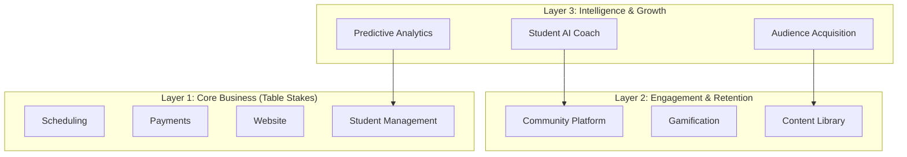

# Enhanced Market Strategy: Critical Gaps and Opportunities from Additional Research

## Executive Summary of New Findings

The second market research reveals crucial insights we missed:

1. **AI Implementation Reality**: Current platforms use AI only "behind the scenes" - NO platform offers student-facing AI coaching
2. **Complexity Paradox**: Teachers are leaving feature-rich platforms for simpler tools (OfferingTree, Momoyoga)
3. **Community as Core**: Built-in community forums drive 40% better retention than platforms without
4. **Audience Acquisition Gap**: All platforms require teachers to bring their own students - none help with discovery
5. **European Market**: 40% of market needs multi-language, VAT handling, local payment methods

## Critical Strategy Enhancements

### 1. 🎯 Student-Facing AI: The Untapped Differentiator

**Current Market Reality:**
- WellnessLiving's Isaac: Only predicts churn, doesn't engage students
- Mindbody's AI: Backend analytics and pricing, not student interaction
- Teachable/Kajabi: AI for content creation, not student experience

**Our Revolutionary Approach:**

```typescript
interface StudentAICoach {
  // Personal Yoga Assistant (24/7)
  chatbot: {
    capabilities: [
      'Answer practice questions',
      'Recommend classes based on how you feel today',
      'Provide pose modifications',
      'Track injuries and suggest safe alternatives'
    ],
    example: "I have lower back pain today, which class should I take?"
  };
  
  // Adaptive Learning System
  personalizedJourney: {
    weeklyPlan: 'AI generates custom practice schedule',
    progressTracking: 'Flexibility, strength, balance metrics',
    milestoneAlerts: 'Celebrate achievements',
    difficultyAdjustment: 'Auto-adapt based on performance'
  };
  
  // Real-Time Practice Support
  liveGuidance: {
    webcamAnalysis: 'Form correction during practice',
    breathingCoach: 'Pace and depth monitoring',
    safetyAlerts: 'Prevent injury with warnings',
    modifications: 'Instant alternative poses'
  };
  
  // Proactive Engagement
  retentionAI: {
    smartNudges: 'Personalized practice reminders',
    motivationalMessages: 'Context-aware encouragement',
    accountabilityPartner: 'AI checks in when you miss practice',
    habitFormation: 'Build consistent practice with AI support'
  };
}
```

**Market Impact**: This makes us the ONLY platform where students get a personal AI yoga coach, justifying premium pricing and creating unmatched retention.

### 2. 🌐 The "Netflix of Yoga" Model: Solving Audience Acquisition

**Problem**: Teachers spend 40% of time on marketing instead of teaching

**Our Solution**: Hybrid SaaS + Marketplace

```typescript
interface YogaNetflix {
  // Discovery Platform
  centralApp: {
    browse: 'Students discover teachers by style, location, speciality',
    freeClasses: 'Try before you subscribe',
    recommendations: 'AI matches students to perfect teachers',
    reviews: 'Social proof and ratings'
  };
  
  // Revenue Model Innovation
  audienceSharing: {
    platformAcquired: {
      split: '70% teacher, 30% platform',
      value: 'We bring the students'
    },
    teacherAcquired: {
      split: '95% teacher, 5% platform',
      value: 'Minimal fees for your own students'
    },
    hybrid: {
      monthly: '$49 + revenue share',
      benefit: 'Best of both worlds'
    }
  };
  
  // Network Effects
  crossPromotion: {
    guestTeaching: 'Teach on other instructor pages',
    bundledSubscriptions: 'Multi-teacher packages',
    referralProgram: 'Students and teachers earn rewards'
  };
}
```

**Competitive Advantage**: Unlike Mindbody's marketplace that cannibalizes clients, our model aligns platform and teacher growth.

### 3. 🤝 Community-as-a-Service: Beyond Basic Forums

**Research Finding**: Platforms with community features have 2.3x better retention

**Enhanced Community Platform:**

```typescript
interface CommunityEngine {
  // Dynamic Interest Groups
  aiClustering: {
    autoGroups: 'AI creates groups based on practice patterns',
    examples: [
      'Morning practitioners',
      'Injury recovery support',
      'Advanced arm balancers',
      'New moms yoga'
    ]
  };
  
  // Engagement Mechanics
  challenges: {
    automated30Day: 'AI generates personalized challenges',
    groupAccountability: 'Teams compete and support',
    streaks: 'Gamified consistency tracking',
    leaderboards: 'Friendly competition'
  };
  
  // Live Interaction
  virtualEvents: {
    weeklyQA: 'AI-moderated teacher Q&A',
    practiceParties: 'Group sessions with multiple teachers',
    workshops: 'Deep-dive learning experiences'
  };
  
  // Peer Support
  buddySystem: {
    matching: 'AI pairs compatible practice partners',
    goals: 'Shared accountability for goals',
    progress: 'Celebrate milestones together'
  };
}
```

### 4. 🚀 Progressive Complexity: The Goldilocks Approach

**Learning from OfferingTree/Momoyoga Success**: Start simple, grow with user

```typescript
interface ProgressiveInterface {
  // Onboarding Modes
  setup: {
    express: {
      time: '5 minutes',
      features: 'Name, one class, payment link',
      target: 'Brand new teachers'
    },
    guided: {
      time: '15 minutes',
      features: 'Full profile, schedule, basic automation',
      target: 'Growing teachers'
    },
    import: {
      time: '30 minutes',
      features: 'Full migration from competitor',
      target: 'Switching from Mindbody'
    }
  };
  
  // Feature Unlocking
  growthPath: {
    milestone1: {
      at: '10 students',
      unlock: 'Email automation, basic analytics'
    },
    milestone2: {
      at: '50 students',
      unlock: 'AI insights, advanced scheduling'
    },
    milestone3: {
      at: '100 students',
      unlock: 'Full AI suite, API access'
    }
  };
  
  // UI Modes
  interfaceModes: {
    zen: 'Minimal, just essentials',
    standard: 'Common features visible',
    power: 'Everything accessible'
  };
}
```

### 5. 🌍 European-First Features

**Market Size**: €22.83B by 2025, but underserved by US-centric platforms

```typescript
interface EuropeanFeatures {
  // Full Localization
  languages: {
    interface: ['EN', 'DE', 'FR', 'ES', 'IT', 'NL', 'PT'],
    aiTranslation: 'Auto-translate all content',
    subtitles: 'Multi-language video captions'
  };
  
  // Compliance & Legal
  regulatory: {
    gdpr: {
      consent: 'Automated consent management',
      dataPortability: 'Export all data anytime',
      rightToErasure: 'Complete deletion tools'
    },
    vatHandling: {
      autoCalculation: 'Per country rates',
      reporting: 'EU VAT MOSS compliant',
      invoicing: 'Legal invoice generation'
    }
  };
  
  // Local Payments
  paymentMethods: {
    sepa: 'Direct debit for EU',
    ideal: 'Netherlands',
    giropay: 'Germany',
    bancontact: 'Belgium'
  };
  
  // Cultural Features
  localAdaptations: {
    scheduling: '24-hour time format',
    dates: 'DD/MM/YYYY format',
    currency: 'Multi-currency pricing',
    holidays: 'Local holiday awareness'
  };
}
```

### 6. 📱 Niche Specialization System

**Opportunity**: Generic platforms miss specialized needs

```typescript
interface NicheTemplates {
  // Pre-configured for specific markets
  meditation: {
    ui: 'Minimalist, calm design',
    features: [
      'Timer with bells',
      'Background sounds library',
      'Guided script builder',
      'Silent day scheduling'
    ],
    pricing: 'Donation-based options'
  };
  
  kidsYoga: {
    ui: 'Colorful, playful design',
    features: [
      'Parent portal',
      'Progress reports',
      'Animated pose guides',
      'Story-based classes'
    ],
    safety: 'Enhanced background checks'
  };
  
  corporate: {
    ui: 'Professional, branded',
    features: [
      'Bulk enrollment',
      'SSO integration',
      'Utilization analytics',
      'ROI reporting'
    ],
    billing: 'NET 30 invoicing'
  };
  
  prenatal: {
    ui: 'Soft, nurturing design',
    features: [
      'Trimester tracking',
      'Medical disclaimers',
      'Partner classes',
      'Postpartum transition'
    ],
    content: 'Specific safety modifications'
  };
}
```

## Revised Platform Architecture

### Three-Layer Value Stack



## Updated Go-to-Market Strategy

### Phase 1: "Simple + Smart" Launch (Months 1-3)

**Target**: Solo teachers overwhelmed by Mindbody but wanting more than OfferingTree

**Key Features**:
- 5-minute setup
- Student-facing AI chat (immediate wow factor)
- Basic scheduling + payments
- Price: $29/month

**Acquisition**:
- Reddit communities (r/yoga, r/yogateachers)
- Facebook groups
- **Hook**: "First platform with AI yoga assistant for YOUR students"

### Phase 2: "Engagement Engine" (Months 4-6)

**Add**:
- Dynamic community features
- AI-powered challenges
- Engagement analytics
- Price: Add $49/month tier

**Growth**:
- Case studies from Phase 1 teachers
- Webinar series: "Double your retention with AI"
- Partner with 5 YTT programs

### Phase 3: "Netflix Launch" (Months 7-9)

**Revolutionary**:
- Launch discovery marketplace
- Revenue sharing model
- Cross-promotion features
- Price: Premium tier $99/month

**Marketing**:
- "We bring you students" campaign
- Free month for first 1000 students
- Teacher success stories

### Phase 4: "European Expansion" (Months 10-12)

**Localization**:
- 6 languages
- VAT compliance
- Local payment methods

**Partnerships**:
- European yoga associations
- Local influencers
- Yoga festivals

## Competitive Positioning Matrix 2.0

| Competitor | Their Strength | Our Counter |
|------------|---------------|------------|
| **Mindbody** | Market leader, brand recognition | 70% cheaper + AI that actually helps students |
| **WellnessLiving** | Isaac AI for retention | Our AI engages students directly, not just analytics |
| **Uscreen** | Video platform expertise | Live classes + AI coach + community |
| **Kajabi** | Course creation tools | Yoga-specific + student AI + simpler |
| **OfferingTree** | Simplicity, price | Same simplicity + AI superpowers |
| **Arketa** | Modern, all-in-one | Better AI, progressive complexity, audience acquisition |
| **Teachable** | AI content creation | AI for students AND teachers |

## Financial Model Enhancement

### Revenue Streams Pyramid

```typescript
const revenueModel = {
  // Base: SaaS Subscriptions
  subscriptions: {
    starter: { price: 29, users: 2000, mrr: 58000 },
    growth: { price: 49, users: 1000, mrr: 49000 },
    pro: { price: 99, users: 300, mrr: 29700 }
  },
  
  // Middle: Transaction Fees
  transactions: {
    volume: 5000000, // $5M GMV/month
    averageFee: 0.04, // 4% average
    mrr: 200000
  },
  
  // Top: Marketplace Revenue Share
  marketplace: {
    platformAcquiredGMV: 1000000,
    revenueShare: 0.30,
    mrr: 300000
  },
  
  // Future: Premium AI Services
  aiServices: {
    personalCoaching: { price: 10, users: 5000, mrr: 50000 },
    businessInsights: { price: 20, users: 500, mrr: 10000 }
  },
  
  totalMRR: 696700, // ~$700k MRR by Month 12
  annualizedRevenue: 8360400 // $8.4M ARR
};
```

## Risk Mitigation Updates

### New Risks from Research

1. **Complexity Creep**: Risk of becoming another overwhelming platform
   - **Mitigation**: Strict progressive disclosure, user testing every feature
   
2. **AI Accuracy for Safety**: Incorrect pose corrections could cause injury
   - **Mitigation**: Conservative corrections only, liability waivers, human review
   
3. **Marketplace Cannibalization**: Teachers fear losing direct relationships
   - **Mitigation**: Clear attribution, teacher branding, optional participation
   
4. **European Regulatory**: GDPR violations could be costly
   - **Mitigation**: Legal review, compliance-first development, EU entity

## Success Metrics Refinement

### Student-Centric KPIs (New)
- **Student Retention**: >80% monthly retention (vs industry 60%)
- **AI Engagement**: >50% of students use AI coach weekly
- **Community Participation**: >30% active in forums
- **Practice Consistency**: 20% increase in practice frequency

### Teacher Success KPIs (Enhanced)
- **Revenue Increase**: Average 40% revenue growth in 6 months
- **Time Saved**: 10 hours/week through automation
- **New Students**: 20% from platform discovery
- **Tool Consolidation**: Replace average 5 tools

## Conclusion: The Winning Formula

Our enhanced strategy addresses every major gap:

1. **Student AI Coach**: First platform with real student-facing AI
2. **Audience Acquisition**: Netflix model brings teachers new students
3. **Progressive Simplicity**: Start simple, grow with success
4. **European Ready**: True global platform from day one
5. **Community Core**: Engagement as primary retention driver

**Our Unique Position**: 
*"The only platform that uses AI to improve student practice while growing teacher businesses"*

This positions us to capture significant share of the $60B market by 2033 by being genuinely different, not just cheaper or feature-rich.