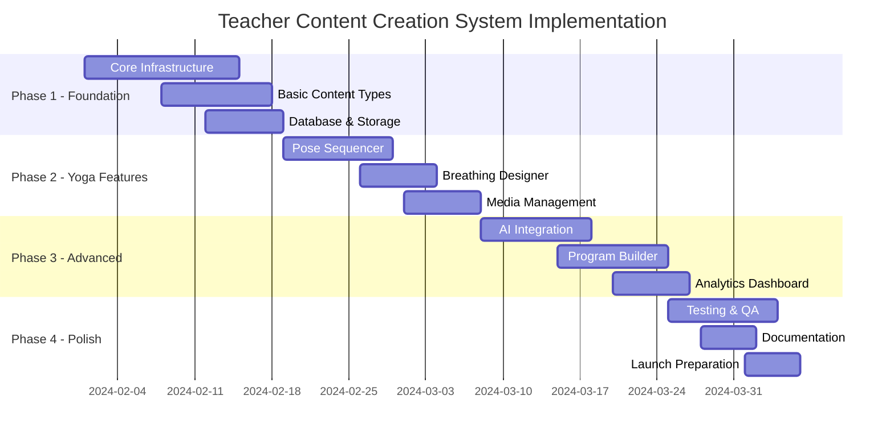

# Teacher Content Creation System - Implementation Plan

## Executive Summary

This document outlines the implementation plan for a comprehensive teacher content creation system that balances yoga-specific requirements with a unified, scalable architecture. The system will support 9 content types with an estimated development time of 10-12 weeks.

## Project Timeline Overview

## Phase 1: Foundation (Weeks 1-3)

### Week 1: Core Infrastructure

#### Tasks:
1. **Database Schema Setup**
   - [ ] Create content tables with JSONB fields
   - [ ] Set up media storage tables
   - [ ] Implement versioning system
   - [ ] Create indexes for performance

2. **API Architecture**
   - [ ] Design RESTful endpoints
   - [ ] Implement content CRUD operations
   - [ ] Set up file upload handling
   - [ ] Create validation middleware

3. **Authentication & Authorization**
   - [ ] Teacher role verification
   - [ ] Content ownership rules
   - [ ] API rate limiting
   - [ ] Session management

**Deliverables:**
- Database migrations
- API documentation
- Auth flow diagram

### Week 2: Basic Content Types

#### Tasks:
1. **Class Content Type**
   - [ ] Video upload interface
   - [ ] Basic metadata forms
   - [ ] Duration calculator
   - [ ] Difficulty selector

2. **Meditation Content Type**
   - [ ] Audio upload
   - [ ] Script editor
   - [ ] Background music selector
   - [ ] Timer configuration

3. **Universal Components**
   - [ ] Title/description editor
   - [ ] Tag manager
   - [ ] Thumbnail uploader
   - [ ] Preview system

**Deliverables:**
- Working create/edit flows for 2 content types
- Reusable component library
- Form validation system

### Week 3: Storage & Media

#### Tasks:
1. **Media Pipeline**
   - [ ] Video processing queue
   - [ ] Thumbnail generation
   - [ ] Audio transcoding
   - [ ] CDN integration

2. **Storage Strategy**
   - [ ] Implement Supabase Storage
   - [ ] Set up backup system
   - [ ] Configure access policies
   - [ ] Optimize for streaming

3. **Content Versioning**
   - [ ] Draft/published states
   - [ ] Revision history
   - [ ] Rollback capability
   - [ ] Change tracking

**Deliverables:**
- Media upload flow
- Storage documentation
- Versioning UI

## Phase 2: Yoga-Specific Features (Weeks 4-6)

### Week 4: Pose Sequencer

#### Tasks:
1. **Pose Library**
   - [ ] Import 500+ poses database
   - [ ] Sanskrit name integration
   - [ ] Categorization system
   - [ ] Search/filter interface

2. **Visual Sequence Builder**
   - [ ] Drag-and-drop interface
   - [ ] Timeline view
   - [ ] Transition suggestions
   - [ ] Duration settings per pose

3. **Sequence Templates**
   - [ ] Pre-built sequences
   - [ ] Save custom templates
   - [ ] Share with community
   - [ ] Import/export functionality

**Deliverables:**
- Interactive pose sequencer
- Pose database
- Template library

### Week 5: Breathing & Specialized Tools

#### Tasks:
1. **Breathing Pattern Designer**
   - [ ] Visual pattern creator
   - [ ] Ratio configurator (4-7-8, etc.)
   - [ ] Audio guide generator
   - [ ] Animation previewer

2. **Chakra Integration**
   - [ ] Chakra selector UI
   - [ ] Color associations
   - [ ] Mantra library
   - [ ] Energy flow visualizer

3. **Ayurveda Features**
   - [ ] Dosha recommendations
   - [ ] Seasonal adjustments
   - [ ] Time-of-day suggestions
   - [ ] Constitution-based modifications

**Deliverables:**
- Breathing exercise creator
- Chakra mapping tool
- Ayurvedic integration

### Week 6: Multi-Language & Accessibility

#### Tasks:
1. **Translation System**
   - [ ] Multi-language content support
   - [ ] Sanskrit transliteration
   - [ ] Pronunciation guides
   - [ ] Cultural adaptations

2. **Accessibility Features**
   - [ ] Closed captions for videos
   - [ ] Audio descriptions
   - [ ] Keyboard navigation
   - [ ] Screen reader support

3. **Modification System**
   - [ ] Prop alternatives
   - [ ] Chair yoga options
   - [ ] Pregnancy modifications
   - [ ] Injury adaptations

**Deliverables:**
- Translation interface
- Accessibility checklist
- Modification library

## Phase 3: Advanced Features (Weeks 7-9)

### Week 7: AI Integration

#### Tasks:
1. **Content Generation**
   - [ ] Sequence suggestions based on focus
   - [ ] Description writer
   - [ ] SEO optimization
   - [ ] Hashtag generator

2. **Safety Validation**
   - [ ] Pose sequence safety check
   - [ ] Contraindication warnings
   - [ ] Progression validation
   - [ ] Warm-up/cool-down verification

3. **Personalization Engine**
   - [ ] Student level adaptation
   - [ ] Time-based variations
   - [ ] Goal-oriented suggestions
   - [ ] Learning path creator

**Deliverables:**
- AI assistant interface
- Safety validation reports
- Personalization settings

### Week 8: Program & Challenge Builder

#### Tasks:
1. **Multi-Day Programs**
   - [ ] Curriculum designer
   - [ ] Day-by-day scheduler
   - [ ] Rest day planner
   - [ ] Progress tracking setup

2. **Challenge Framework**
   - [ ] 7/21/30-day templates
   - [ ] Milestone creator
   - [ ] Badge designer
   - [ ] Community features

3. **Prerequisites System**
   - [ ] Dependency mapper
   - [ ] Skill progression paths
   - [ ] Completion requirements
   - [ ] Certificate generator

**Deliverables:**
- Program creation wizard
- Challenge management dashboard
- Certificate templates

### Week 9: Analytics & Insights

#### Tasks:
1. **Performance Dashboard**
   - [ ] View count tracking
   - [ ] Completion rates
   - [ ] Student feedback analysis
   - [ ] Revenue metrics

2. **Content Analytics**
   - [ ] Popular sequences
   - [ ] Drop-off points
   - [ ] Engagement heatmaps
   - [ ] A/B testing framework

3. **Student Insights**
   - [ ] Demographics breakdown
   - [ ] Practice patterns
   - [ ] Feedback aggregation
   - [ ] Progress tracking

**Deliverables:**
- Analytics dashboard
- Report generator
- Insight notifications

## Phase 4: Testing & Launch (Weeks 10-12)

### Week 10: Quality Assurance

#### Tasks:
1. **Functional Testing**
   - [ ] All content types creation
   - [ ] Edit/delete operations
   - [ ] Media upload scenarios
   - [ ] Edge cases handling

2. **Performance Testing**
   - [ ] Load testing
   - [ ] Video streaming optimization
   - [ ] Database query optimization
   - [ ] CDN configuration

3. **Security Testing**
   - [ ] Authentication flows
   - [ ] File upload validation
   - [ ] XSS/CSRF protection
   - [ ] API penetration testing

**Deliverables:**
- Test reports
- Bug tracker
- Performance benchmarks

### Week 11: Beta Testing

#### Tasks:
1. **Teacher Onboarding**
   - [ ] Select 10-20 beta teachers
   - [ ] Training materials
   - [ ] Feedback collection system
   - [ ] Support channel setup

2. **Content Migration**
   - [ ] Import existing content
   - [ ] Bulk upload tools
   - [ ] Data validation
   - [ ] Rollback procedures

3. **Iteration & Fixes**
   - [ ] Priority bug fixes
   - [ ] UI/UX improvements
   - [ ] Performance optimization
   - [ ] Feature refinements

**Deliverables:**
- Beta feedback report
- Migration tools
- Updated documentation

### Week 12: Launch Preparation

#### Tasks:
1. **Documentation**
   - [ ] Teacher guide
   - [ ] Video tutorials
   - [ ] FAQ section
   - [ ] API documentation

2. **Marketing Materials**
   - [ ] Feature highlights
   - [ ] Demo videos
   - [ ] Email campaigns
   - [ ] Social media content

3. **Production Deployment**
   - [ ] Environment setup
   - [ ] Monitoring configuration
   - [ ] Backup verification
   - [ ] Launch checklist

**Deliverables:**
- Complete documentation
- Marketing assets
- Production system

## Resource Requirements

### Team Composition
- **Lead Developer** (Full-time)
- **Frontend Developer** (Full-time)
- **Backend Developer** (Full-time)
- **UI/UX Designer** (Part-time, first 6 weeks)
- **QA Engineer** (Part-time, weeks 8-12)
- **DevOps Engineer** (Part-time, weeks 10-12)
- **Yoga Consultant** (Part-time, throughout)

### Technology Stack
- **Frontend**: Next.js 15, React 19, TypeScript, Framer Motion
- **Backend**: Node.js, Drizzle ORM, PostgreSQL
- **Storage**: Supabase Storage, CDN (Cloudflare)
- **AI**: OpenAI API for content generation
- **Media**: FFmpeg for video processing, Sharp for images
- **Testing**: Jest, Playwright, k6 for load testing

### Infrastructure Costs (Monthly Estimate)
- **Supabase**: $25-50 (database + storage)
- **CDN**: $20-100 (based on usage)
- **AI API**: $50-200 (based on usage)
- **Monitoring**: $30 (Sentry, analytics)
- **Total**: ~$125-380/month

## Risk Management

### Technical Risks
1. **Video Processing Performance**
   - *Mitigation*: Use queue system with worker processes
   - *Fallback*: Third-party encoding service

2. **Storage Costs**
   - *Mitigation*: Implement storage quotas
   - *Fallback*: Tiered pricing model

3. **AI Hallucinations**
   - *Mitigation*: Human review for AI-generated content
   - *Fallback*: Disable AI features if needed

### Business Risks
1. **Teacher Adoption**
   - *Mitigation*: Extensive beta testing and training
   - *Fallback*: Phased rollout with feedback loops

2. **Content Quality**
   - *Mitigation*: Peer review system
   - *Fallback*: Manual moderation

3. **Complexity Overwhelm**
   - *Mitigation*: Progressive disclosure UI
   - *Fallback*: Simplified mode option

## Success Metrics

### Phase 1 Metrics
- Database response time < 100ms
- File upload success rate > 99%
- API endpoint availability > 99.9%

### Phase 2 Metrics
- Pose sequence creation < 5 minutes
- 100% Sanskrit name coverage
- Accessibility score > 95%

### Phase 3 Metrics
- AI suggestion acceptance rate > 60%
- Program completion rate > 40%
- Analytics dashboard load time < 2s

### Phase 4 Metrics
- Beta teacher satisfaction > 4.5/5
- Bug discovery rate < 5 per day
- Launch readiness score > 95%

## Rollout Strategy

### Soft Launch (Week 13)
- 50 selected teachers
- Limited content types
- Feedback collection

### Beta Launch (Week 14)
- 200 teachers
- All content types
- Community features

### Public Launch (Week 15)
- All teachers
- Full feature set
- Marketing campaign

## Maintenance & Future Enhancements

### Immediate Post-Launch (Months 1-3)
- Bug fixes and stability improvements
- Performance optimization
- User feedback implementation

### Medium-term (Months 4-6)
- Live streaming integration
- Mobile app development
- Advanced analytics features

### Long-term (Months 7-12)
- AI pose correction
- Virtual reality support
- Marketplace features

## Conclusion

This implementation plan provides a structured approach to building a comprehensive teacher content creation system. The phased approach allows for iterative development, continuous testing, and gradual feature rollout while maintaining system stability and teacher satisfaction.

The total estimated timeline is 12 weeks with a team of 4-6 people, with an estimated monthly infrastructure cost of $125-380. Success will be measured through technical performance metrics, teacher adoption rates, and content quality indicators.