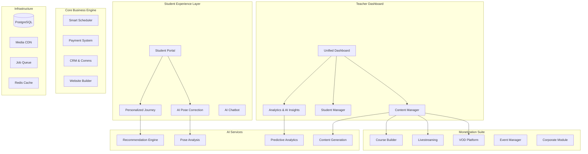

# Market-Aligned Platform Strategy: From Content Creation to Business-in-a-Box

## Executive Summary

Based on comprehensive market research revealing a $20B market opportunity growing at 18% CAGR, we're pivoting from a "Teacher Content Creation System" to an **"Intelligent All-in-One Platform for the Modern Yoga-preneur"**. This strategic shift addresses the critical market gap: yoga teachers are forced to either use expensive, complex enterprise software (Mindbody at $129+/mo) or stitch together 5-7 different tools, creating inefficiency and frustration.

Our positioning: **"Effortless Business, Intelligent Practice"** - leveraging AI as a core differentiator, not a peripheral feature.

## Market-Driven Architecture Principles

### 1. The Yoga-preneur's Jobs-to-be-Done

```typescript
interface YogaPreneurNeeds {
  // Core Business Operations (Table Stakes)
  scheduling: {
    hybrid: true, // Both online and in-person
    recurring: true,
    waitlists: true,
    cancellations: true
  };
  
  payments: {
    processing: true,
    subscriptions: true,
    packages: true,
    flexiblePricing: true // Pay-what-you-can, sliding scale
  };
  
  studentManagement: {
    crm: true,
    waivers: true,
    attendance: true,
    communication: true
  };
  
  // Growth & Monetization (Differentiators)
  contentMonetization: {
    vod: true,
    livestreaming: true,
    courses: true,
    digitalProducts: true,
    retreats: true,
    corporate: true
  };
  
  marketing: {
    website: true,
    email: true,
    sms: true,
    social: true,
    seo: true,
    funnels: true
  };
  
  // AI-Powered Intelligence (Our Moat)
  aiFeatures: {
    poseCorrection: true,
    contentGeneration: true,
    churnPrediction: true,
    scheduleOptimization: true,
    personalizedJourneys: true,
    chatbot: true
  };
}
```

### 2. Platform Architecture: Modular but Integrated



## Revised Platform Features Based on Market Gaps

### Phase 1: Core Business Platform (Weeks 1-4)
**Goal**: Match basic functionality of OfferingTree/Momoyoga at lower price

#### 1.1 Smart Scheduling System
```typescript
interface SmartScheduler {
  // Hybrid class management
  classTypes: 'in-person' | 'online' | 'hybrid';
  
  // Intelligent features
  autoSchedule: {
    analyzeAttendance: true,
    suggestOptimalTimes: true,
    predictCapacity: true
  };
  
  // Booking rules
  bookingWindows: CustomizableRules;
  cancellationPolicies: FlexiblePolicies;
  waitlistManagement: Automated;
  
  // Integration
  googleCalendar: true;
  zoom: true;
  teacherAvailability: SmartMatching;
}
```

#### 1.2 Flexible Payment System
```typescript
interface PaymentSystem {
  // Multiple payment models
  models: {
    dropIn: true,
    packages: { 5: '$60', 10: '$110' },
    memberships: { monthly: true, annual: true },
    slidingScale: true, // Equity pricing
    donations: true,
    payWhatYouCan: true
  };
  
  // Revenue optimization
  dynamicPricing: {
    earlyBird: true,
    lastMinute: true,
    peakHours: true
  };
  
  // Platform fee structure (Revolutionary)
  performanceBasedFees: {
    first1000: '10%',
    next4000: '8%',
    next10000: '6%',
    above15000: '4%'
  };
}
```

#### 1.3 Student CRM
```typescript
interface StudentCRM {
  // Core data
  profiles: CompleteStudentRecord;
  attendance: AutomatedTracking;
  
  // Communication
  segments: SmartSegmentation;
  campaigns: {
    welcomeSeries: Automated;
    winBack: AITriggered;
    birthday: Personalized;
    milestones: Celebrated;
  };
  
  // Retention tools
  churnRisk: {
    prediction: MLBased;
    intervention: Automated;
    success: Tracked;
  };
}
```

### Phase 2: AI-Powered Differentiators (Weeks 5-8)
**Goal**: Deliver unique value that competitors can't match

#### 2.1 AI Pose Correction System
```typescript
interface AIPoseCorrection {
  // Real-time analysis
  technology: 'MediaPipe' | 'PoseNet' | 'MoveNet';
  
  features: {
    liveFeeback: {
      alignment: true,
      safety: true,
      modifications: true
    };
    
    postClassReport: {
      formScore: number;
      improvements: string[];
      risks: string[];
    };
    
    progressTracking: {
      flexibility: Measured;
      strength: Tracked;
      balance: Quantified;
    };
  };
  
  // New monetization primitive
  monetization: {
    premiumTier: 'AI-Guided Practice',
    formCheckService: '$5 per session',
    personalizedCorrections: 'Included in Pro'
  };
}
```

#### 2.2 Marketing AI Assistant
```typescript
interface MarketingAI {
  contentGeneration: {
    socialPosts: {
      platforms: ['Instagram', 'Facebook', 'TikTok'],
      frequency: 'Daily suggestions',
      voiceMatching: true
    };
    
    emailNewsletters: {
      templates: PreBuilt;
      personalization: PerStudent;
      subjectLineOptimization: ABTested;
    };
    
    classDescriptions: {
      seoOptimized: true,
      benefitsFocused: true,
      levelAppropriate: true
    };
    
    blogPosts: {
      topics: AISuggested;
      drafts: Generated;
      images: Created;
    };
  };
  
  automation: {
    scheduling: OptimalTimes;
    hashtags: Researched;
    responses: Templated;
  };
}
```

#### 2.3 Predictive Business Analytics
```typescript
interface PredictiveAnalytics {
  // Churn prediction
  churnRisk: {
    model: 'GradientBoosting',
    factors: [
      'attendanceDecline',
      'engagementDrop',
      'paymentDelays',
      'supportTickets'
    ],
    interventions: {
      automated: ['email', 'sms', 'specialOffer'],
      suggested: ['personalCall', 'privateSession']
    }
  };
  
  // Revenue optimization
  revenueForecasting: {
    seasonal: Modeled;
    growth: Projected;
    opportunities: Identified;
  };
  
  // Schedule optimization
  classPerformance: {
    optimal: TimesIdentified;
    underperforming: Flagged;
    recommendations: DataDriven;
  };
}
```

### Phase 3: Content Monetization Suite (Weeks 9-10)
**Goal**: Enable diverse revenue streams beyond per-class payments

#### 3.1 Multi-Stream Monetization
```typescript
interface MonetizationStreams {
  // Traditional
  classes: {
    dropIn: true,
    packages: true,
    memberships: true
  };
  
  // Digital products
  onDemand: {
    subscriptionLibrary: true,
    individualPurchase: true,
    rentals: true
  };
  
  // High-ticket items
  courses: {
    selfPaced: true,
    cohortBased: true,
    certifications: true
  };
  
  workshops: {
    virtual: true,
    hybrid: true,
    recordings: true
  };
  
  retreats: {
    registration: true,
    payments: true,
    logistics: true
  };
  
  // B2B
  corporate: {
    packages: Customizable;
    billing: Streamlined;
    reporting: Comprehensive;
    compliance: Managed;
  };
  
  // Innovative
  nftCertificates: Optional;
  tokenGatedContent: Future;
}
```

### Phase 4: Migration & Launch (Weeks 11-12)
**Goal**: Make switching from competitors painless

#### 4.1 White-Glove Migration Service
```typescript
interface MigrationService {
  supportedPlatforms: [
    'Mindbody',
    'WellnessLiving',
    'Momoyoga',
    'OfferingTree',
    'Walla',
    'GoogleSheets'
  ];
  
  dataTypes: {
    clients: FullImport;
    schedules: Maintained;
    packages: Honored;
    history: Preserved;
    content: Migrated;
  };
  
  process: {
    assessment: Free;
    migration: Managed;
    validation: Thorough;
    training: Included;
    support: '90 days white-glove';
  };
}
```

## Pricing Strategy Aligned with Market Research

### Tiered Pricing Model

```typescript
const pricingTiers = {
  // Remove barrier to entry
  starter: {
    monthly: 0,
    features: [
      'Up to 20 students',
      '10% transaction fee',
      'Basic scheduling',
      'Payment processing',
      'Simple website'
    ],
    target: 'New teachers, testing the platform'
  },
  
  // Sweet spot for solopreneurs
  growth: {
    monthly: 49,
    annually: 470, // 2 months free
    features: [
      'Up to 200 students',
      '5% transaction fee',
      'All scheduling features',
      'Email/SMS marketing',
      'VOD hosting (50GB)',
      'AI content generation',
      'Basic analytics'
    ],
    target: 'Established independent teachers'
  },
  
  // Power users
  pro: {
    monthly: 99,
    annually: 950,
    features: [
      'Unlimited students',
      '3% transaction fee',
      'Everything in Growth',
      'AI pose correction',
      'Predictive analytics',
      'Custom branded app',
      'Priority support',
      'API access'
    ],
    target: 'Successful teachers, small studios'
  },
  
  // Growth alignment
  studio: {
    monthly: 199,
    annually: 1900,
    features: [
      'Multi-teacher',
      '2% transaction fee',
      'Everything in Pro',
      'Advanced reporting',
      'Custom integrations',
      'Dedicated success manager'
    ],
    target: 'Studios with 2-5 teachers'
  }
};

// Revolutionary: Performance-based pricing
const revenueShare = {
  enabled: true,
  structure: {
    tier1: { upTo: 1000, share: 0.10 },
    tier2: { upTo: 5000, share: 0.08 },
    tier3: { upTo: 15000, share: 0.06 },
    tier4: { above: 15000, share: 0.04 }
  },
  message: 'We grow when you grow'
};
```

## Go-to-Market Strategy Based on Competition Analysis

### Phase 1: Beachhead (Months 1-3)
**Target**: Frustrated Mindbody/WellnessLiving users

```typescript
const beachheadStrategy = {
  channels: {
    reddit: {
      communities: ['r/YogaTeachers', 'r/yoga'],
      approach: 'Answer pain point posts, offer solutions'
    },
    
    facebook: {
      groups: ['Yoga Teachers Network', 'Yoga Business Support'],
      approach: 'Share valuable content, build trust'
    },
    
    direct: {
      outreach: 'Contact teachers posting Mindbody complaints',
      offer: 'Free migration + 3 months at 50% off'
    }
  },
  
  messaging: {
    primary: 'Finally, software that works FOR you, not against you',
    secondary: 'Built by yoga teachers, for yoga teachers',
    proof: 'Join 100+ teachers who switched and saved 70%'
  },
  
  incentives: {
    earlyAdopter: '50% off for first 100 users, lifetime',
    referral: 'Give 1 month, get 1 month',
    migration: 'Free white-glove service (normally $500)'
  }
};
```

### Phase 2: Expansion (Months 4-6)
**Target**: New teachers from YTT programs

```typescript
const expansionStrategy = {
  partnerships: {
    yttPrograms: {
      targets: ['Yoga Alliance schools', 'Online YTTs'],
      offer: 'Free Pro for all graduates (6 months)',
      benefit: 'Exclusive partnership, curriculum integration'
    },
    
    influencers: {
      micro: '10-50k followers',
      compensation: 'Revenue share or free lifetime Pro',
      content: 'Authentic reviews, tutorials'
    }
  },
  
  contentMarketing: {
    seo: {
      keywords: ['yoga business', 'yoga studio software', 'alternative to mindbody'],
      content: 'Comprehensive guides, calculators, templates'
    },
    
    webinars: {
      topics: ['Launch your yoga business', 'Triple your revenue', 'Build online following'],
      frequency: 'Weekly',
      conversion: 'Special offer for attendees'
    }
  }
};
```

### Phase 3: Domination (Months 7-12)
**Target**: Corporate wellness market

```typescript
const dominationStrategy = {
  b2b: {
    corporateModule: {
      features: [
        'Employee self-registration',
        'Liability management',
        'Utilization reporting',
        'Multi-location support',
        'SSO integration'
      ],
      pricing: 'Per employee per month',
      sales: 'Direct enterprise sales'
    },
    
    partnerships: {
      benefits: ['Wellness platforms', 'Insurance companies'],
      hr: ['SHRM partnership', 'HR tech integrations']
    }
  },
  
  platform: {
    marketplace: 'Connect teachers with corporate clients',
    certification: 'Platform-verified teachers',
    quality: 'Guaranteed service levels'
  }
};
```

## Success Metrics Aligned with Market Opportunity

### North Star Metrics

```typescript
const northStarMetrics = {
  // Platform success = Teacher success
  teacherRevenue: {
    metric: 'Total GMV processed',
    target: '$10M in Year 1',
    growth: '200% YoY'
  },
  
  // Solving the fragmentation problem
  toolsReplaced: {
    metric: 'Average tools replaced per teacher',
    target: '>4 tools',
    validation: 'We solved the Zapier tax'
  },
  
  // Better than incumbents
  nps: {
    metric: 'Net Promoter Score',
    target: '>70',
    benchmark: 'Mindbody ~20'
  },
  
  // Sustainable growth
  ltv_cac: {
    metric: 'LTV/CAC ratio',
    target: '>3',
    payback: '<12 months'
  }
};
```

### Operational KPIs

```typescript
const operationalKPIs = {
  acquisition: {
    signups: '500/month by Month 6',
    conversion: '15% free to paid',
    activation: '80% create first class'
  },
  
  retention: {
    churn: '<5% monthly',
    expansion: '120% net revenue retention',
    engagement: '70% weekly active'
  },
  
  monetization: {
    arpu: '$65/month',
    transactions: '$2M/month GMV',
    take_rate: '6% average'
  }
};
```

## Technical Architecture Optimizations

### Simplified Tech Stack for Speed

```typescript
const techStack = {
  // Monorepo for speed
  architecture: 'Modular monolith → Microservices when needed',
  
  // Proven, scalable choices
  frontend: {
    framework: 'Next.js 15',
    ui: 'Tailwind + Radix UI',
    state: 'Zustand',
    forms: 'React Hook Form + Zod'
  },
  
  backend: {
    runtime: 'Node.js + Bun',
    api: 'tRPC for type safety',
    db: 'PostgreSQL + Drizzle',
    cache: 'Redis',
    queue: 'BullMQ'
  },
  
  ai: {
    pose: 'MediaPipe (client-side)',
    nlp: 'OpenAI API',
    ml: 'Python microservice (scikit-learn)'
  },
  
  infrastructure: {
    hosting: 'Vercel + Railway',
    media: 'Cloudflare R2 + Stream',
    payments: 'Stripe',
    email: 'Resend',
    sms: 'Twilio'
  }
};
```

### Database Schema Optimizations

```sql
-- Simplified, market-focused schema
CREATE TABLE users (
    id UUID PRIMARY KEY,
    type ENUM('student', 'teacher', 'studio'),
    -- Flatten for performance
    subscription_tier VARCHAR(20),
    subscription_status VARCHAR(20),
    trial_ends_at TIMESTAMP,
    -- Track platform value
    tools_replaced TEXT[],
    previous_platform VARCHAR(50),
    monthly_revenue_before DECIMAL,
    monthly_revenue_current DECIMAL
);

CREATE TABLE classes (
    id UUID PRIMARY KEY,
    teacher_id UUID REFERENCES users(id),
    type ENUM('in_person', 'online', 'hybrid'),
    -- Scheduling
    start_time TIMESTAMP,
    duration_minutes INTEGER,
    recurring_rule JSONB,
    -- Monetization
    pricing_model VARCHAR(20),
    price_amount DECIMAL,
    -- Analytics
    attendance_count INTEGER,
    revenue_generated DECIMAL,
    satisfaction_score DECIMAL
);

-- Key indexes for performance
CREATE INDEX idx_classes_teacher_time ON classes(teacher_id, start_time);
CREATE INDEX idx_users_subscription ON users(subscription_status, subscription_tier);
```

## Risk Mitigation Strategies

### Technical Risks
1. **AI Accuracy**: Start with basic pose detection, improve with user data
2. **Scaling**: Use proven tech, optimize later
3. **Integration complexity**: Build native first, integrate later

### Business Risks
1. **Incumbent response**: Move fast, build moat with AI and community
2. **Teacher adoption**: White-glove onboarding, success-based pricing
3. **Churn**: Predictive analytics, proactive intervention

### Market Risks
1. **Economic downturn**: Free tier, pay-as-you-grow model
2. **Competition**: Focus on teacher success, not feature parity
3. **Platform dependence**: Own the teacher relationship

## Conclusion

By aligning our platform architecture with the clear market gaps identified in the research, we can build a defensible, high-growth business that genuinely serves the modern yoga-preneur. The key is not just building features, but solving the fundamental business problem: **helping yoga teachers build sustainable, growing businesses while maintaining their focus on teaching and community.**

Our differentiation comes from three core principles:
1. **AI-First Architecture**: Not bolted on, but built in from day one
2. **Success-Aligned Pricing**: We win when teachers win
3. **Effortless Experience**: Complex problems, simple solutions

The $20B market opportunity is real, the incumbent vulnerabilities are clear, and the technology to disrupt exists today. By focusing relentlessly on the yoga-preneur's success, we can capture significant market share and build the definitive platform for the next generation of yoga teachers.