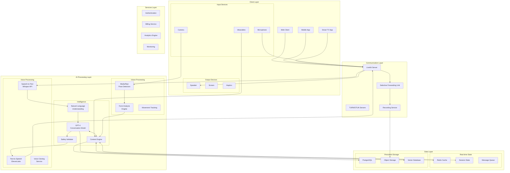
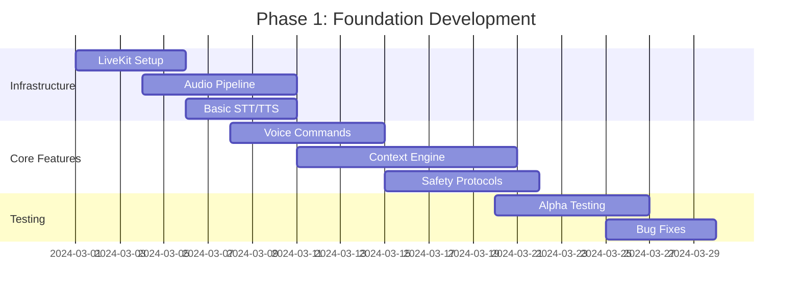
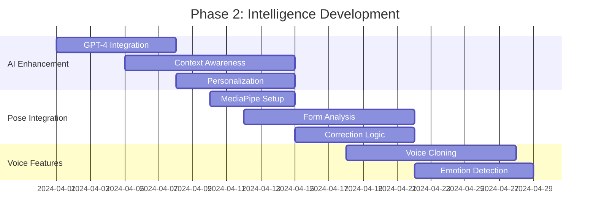
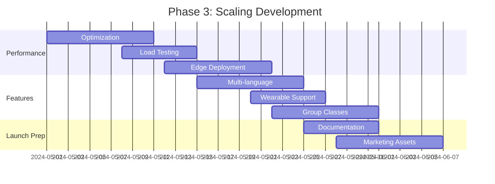
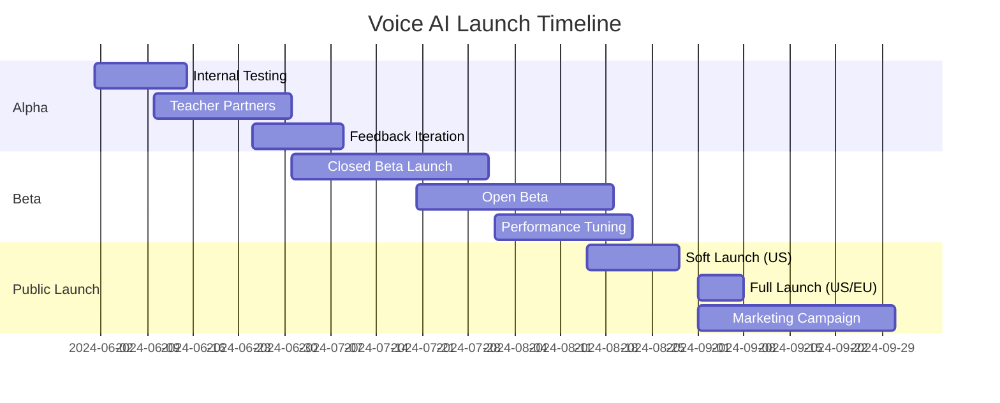

# Voice AI System: Comprehensive Documentation

## Table of Contents

1. [Executive Overview](#executive-overview)
2. [System Architecture](#system-architecture)
3. [Technical Implementation](#technical-implementation)
4. [Voice AI Capabilities](#voice-ai-capabilities)
5. [Development Roadmap](#development-roadmap)
6. [Integration Guidelines](#integration-guidelines)
7. [Performance Specifications](#performance-specifications)
8. [Safety & Compliance](#safety-compliance)
9. [Business Model](#business-model)
10. [Deployment Strategy](#deployment-strategy)

## Executive Overview

### Vision Statement

The Voice AI System represents a paradigm shift in digital yoga instruction, transforming passive video consumption into interactive, personalized practice sessions. By leveraging LiveKit's real-time communication infrastructure combined with advanced AI models, we create an "always-on teacher" experience that provides real-time guidance, corrections, and motivation during practice.

### Core Value Proposition

- **For Students**: Personal yoga instructor available 24/7, speaking directly to you during practice
- **For Teachers**: Ability to teach thousands simultaneously without being present
- **For Platform**: Unique differentiator that creates an insurmountable competitive moat

### Key Innovation

Unlike existing platforms that offer pre-recorded videos or post-practice feedback, our Voice AI System provides:
- Real-time voice interaction during practice
- Contextual awareness of student's current state
- Personalized modifications and encouragement
- Seamless integration with visual pose detection
- Teacher voice cloning for authentic experience

## System Architecture

### High-Level Architecture Diagram



### Component Descriptions

#### LiveKit Infrastructure
- **Purpose**: Real-time audio/video communication backbone
- **Components**:
  - SFU for efficient media routing
  - TURN/STUN for NAT traversal
  - Recording service for session playback
  - Room management for session isolation

#### AI Processing Pipeline
- **Speech Recognition**: Whisper API for accurate transcription
- **Language Understanding**: Custom NLU for yoga-specific intents
- **Conversation Engine**: GPT-4 with yoga-specific fine-tuning
- **Voice Synthesis**: ElevenLabs for natural speech generation
- **Pose Analysis**: MediaPipe for real-time form detection

#### Context Management
- **Session State**: Current pose, duration, sequence position
- **Student Profile**: History, preferences, limitations
- **Teacher Settings**: Voice profile, teaching style, custom cues
- **Safety Rules**: Injury prevention, modification protocols

## Technical Implementation

### Core Technologies Stack

```yaml
# Infrastructure
communication:
  framework: LiveKit
  version: 1.5.0
  deployment: Kubernetes
  scaling: Horizontal auto-scaling

# AI Models
voice:
  stt:
    provider: OpenAI Whisper
    model: whisper-1
    languages: 50+
  
  tts:
    provider: ElevenLabs
    model: Multilingual v2
    voices: Custom + Cloned
  
  llm:
    provider: OpenAI
    model: gpt-4-turbo
    context: 128k tokens

vision:
  pose_detection:
    framework: MediaPipe
    model: BlazePose
    fps: 30
    landmarks: 33

# Backend
api:
  language: TypeScript
  runtime: Node.js 20
  framework: Express/tRPC
  
database:
  primary: PostgreSQL 15
  cache: Redis 7
  vector: Pinecone
  
messaging:
  queue: BullMQ
  pubsub: Redis Pub/Sub
  
storage:
  objects: AWS S3
  cdn: CloudFlare
```

### Voice AI Class Implementation

```typescript
// Core Voice AI Implementation
import { Room, RoomEvent, Participant, Track } from 'livekit-client';
import { LiveKitServer } from 'livekit-server-sdk';

interface VoiceAIConfig {
  teacherId: string;
  studentId: string;
  classType: 'live' | 'recorded' | 'ai-only';
  voiceProfile: VoiceProfile;
  safetySettings: SafetySettings;
}

class YogaVoiceAI {
  private room: Room;
  private context: PracticeContext;
  private speechRecognizer: SpeechRecognizer;
  private voiceSynthesizer: VoiceSynthesizer;
  private conversationEngine: ConversationEngine;
  private poseAnalyzer: PoseAnalyzer;
  
  constructor(config: VoiceAIConfig) {
    this.initializeLiveKit(config);
    this.setupAudioPipeline();
    this.loadTeacherProfile(config.teacherId);
    this.loadStudentHistory(config.studentId);
  }
  
  private async initializeLiveKit(config: VoiceAIConfig) {
    this.room = new Room({
      adaptiveStream: true,
      dynacast: true,
      videoCaptureDefaults: {
        resolution: { width: 1280, height: 720 },
        frameRate: 30
      },
      audioCaptureDefaults: {
        echoCancellation: true,
        noiseSuppression: true,
        autoGainControl: true
      }
    });
    
    // Connect to LiveKit room
    await this.room.connect(process.env.LIVEKIT_URL, token, {
      autoSubscribe: true
    });
    
    // Listen for audio tracks
    this.room.on(RoomEvent.TrackSubscribed, this.handleTrackSubscribed);
    this.room.on(RoomEvent.TrackUnsubscribed, this.handleTrackUnsubscribed);
    this.room.on(RoomEvent.DataReceived, this.handleDataReceived);
  }
  
  private async handleAudioInput(audioData: Float32Array) {
    // 1. Voice Activity Detection
    if (!this.detectVoiceActivity(audioData)) return;
    
    // 2. Transcribe speech
    const transcript = await this.speechRecognizer.transcribe(audioData);
    
    // 3. Extract intent with context
    const intent = await this.extractIntent(transcript);
    
    // 4. Generate response
    const response = await this.generateResponse(intent);
    
    // 5. Safety validation
    const safeResponse = await this.validateSafety(response);
    
    // 6. Synthesize speech
    const audioResponse = await this.voiceSynthesizer.synthesize(
      safeResponse.text,
      {
        voice: this.config.voiceProfile,
        emotion: safeResponse.emotion,
        pace: this.calculateSpeakingPace()
      }
    );
    
    // 7. Publish audio to room
    await this.publishAudio(audioResponse);
    
    // 8. Update context
    this.updateContext(intent, response);
  }
  
  private async extractIntent(transcript: string): Promise<Intent> {
    const currentState = await this.getCurrentState();
    
    return this.conversationEngine.extractIntent({
      text: transcript,
      context: {
        currentPose: currentState.pose,
        timeInPose: currentState.duration,
        sequencePosition: currentState.sequenceIndex,
        studentMetrics: currentState.metrics,
        recentHistory: this.context.recentInteractions
      }
    });
  }
  
  private async generateResponse(intent: Intent): Promise<Response> {
    const prompt = this.buildPrompt(intent);
    
    const completion = await this.conversationEngine.complete({
      prompt,
      maxTokens: 150,
      temperature: 0.7,
      systemPrompt: this.getSystemPrompt()
    });
    
    return {
      text: completion.text,
      emotion: this.detectEmotion(intent),
      actions: this.extractActions(completion),
      timing: this.calculateTiming(intent)
    };
  }
  
  private getSystemPrompt(): string {
    return `You are a yoga instructor AI assistant with these characteristics:
    - Voice: ${this.config.voiceProfile.style}
    - Teaching style: ${this.teacher.style}
    - Student level: ${this.student.level}
    - Current pose: ${this.context.currentPose}
    - Safety priorities: ${this.config.safetySettings}
    
    Guidelines:
    - Keep responses concise (1-2 sentences)
    - Prioritize safety over performance
    - Use encouraging, non-judgmental language
    - Adapt to student's current state
    - Reference previous interactions when relevant`;
  }
  
  // Continuous monitoring loop
  async startContinuousGuidance() {
    const guidanceLoop = setInterval(async () => {
      const state = await this.assessCurrentState();
      
      // Check if intervention needed
      if (state.needsCorrection) {
        await this.provideCorrection(state.correction);
      }
      
      // Transition guidance
      if (state.transitionTime) {
        await this.guideTransition(state.nextPose);
      }
      
      // Breathing cues
      if (state.breathingReminder) {
        await this.cueBreathing(state.breathPattern);
      }
      
      // Motivational check-ins
      if (state.checkInTime) {
        await this.checkInWithStudent();
      }
      
      // Safety monitoring
      if (state.safetyAlert) {
        await this.handleSafetyAlert(state.alert);
      }
      
    }, 1000); // Check every second
    
    this.room.on(RoomEvent.Disconnected, () => {
      clearInterval(guidanceLoop);
    });
  }
}
```

### Context Engine Implementation

```typescript
interface PracticeContext {
  // Session Information
  session: {
    id: string;
    startTime: Date;
    classType: string;
    duration: number;
    teacherId: string;
    studentId: string;
  };
  
  // Current State
  current: {
    pose: string;
    poseStartTime: Date;
    duration: number;
    side: 'left' | 'right' | 'center';
    sequenceIndex: number;
    totalSequenceLength: number;
  };
  
  // Student Metrics
  metrics: {
    heartRate?: number;
    breathingRate?: number;
    stressLevel?: 'low' | 'medium' | 'high';
    fatigue?: number; // 0-100
    formAccuracy?: number; // 0-100
  };
  
  // Interaction History
  history: {
    recentQuestions: Array<{
      question: string;
      answer: string;
      timestamp: Date;
    }>;
    corrections: Array<{
      pose: string;
      correction: string;
      resolved: boolean;
    }>;
    modifications: Array<{
      original: string;
      modified: string;
      reason: string;
    }>;
  };
  
  // Safety Tracking
  safety: {
    injuries: string[];
    limitations: string[];
    redFlags: string[];
    emergencyProtocol: boolean;
  };
}

class ContextEngine {
  private redis: RedisClient;
  private state: PracticeContext;
  
  async updatePoseContext(pose: string) {
    const previousPose = this.state.current.pose;
    
    this.state.current = {
      ...this.state.current,
      pose,
      poseStartTime: new Date(),
      duration: 0
    };
    
    // Store transition for learning
    await this.recordTransition(previousPose, pose);
    
    // Update pose-specific safety rules
    await this.loadPoseSafetyRules(pose);
    
    // Check if modification needed
    const needsModification = await this.checkModificationNeeded(pose);
    if (needsModification) {
      await this.triggerModification(pose);
    }
  }
  
  async integrateWearableData(data: WearableData) {
    this.state.metrics = {
      ...this.state.metrics,
      heartRate: data.heartRate,
      breathingRate: data.breathingRate,
      stressLevel: this.calculateStressLevel(data)
    };
    
    // Trigger alerts if needed
    if (this.state.metrics.heartRate > this.getSafeHeartRate()) {
      await this.triggerRestBreak();
    }
  }
  
  async integratePoseDetection(poseData: PoseData) {
    const formAccuracy = await this.calculateFormAccuracy(poseData);
    
    this.state.metrics.formAccuracy = formAccuracy;
    
    if (formAccuracy < 60) {
      await this.triggerFormCorrection(poseData);
    }
  }
  
  private async calculateFormAccuracy(poseData: PoseData): Promise<number> {
    const idealPose = await this.getIdealPose(this.state.current.pose);
    
    // Compare joint angles
    const angleAccuracy = this.compareJointAngles(
      poseData.joints,
      idealPose.joints
    );
    
    // Check alignment
    const alignmentScore = this.checkAlignment(poseData.landmarks);
    
    // Weight distribution (if available)
    const balanceScore = poseData.pressure 
      ? this.analyzeBalance(poseData.pressure)
      : 100;
    
    return (angleAccuracy * 0.5 + alignmentScore * 0.3 + balanceScore * 0.2);
  }
}
```

## Voice AI Capabilities

### Core Interaction Capabilities

#### 1. Real-Time Guidance

```typescript
interface GuidanceCapabilities {
  // Pose Instructions
  poseGuidance: {
    entry: "From mountain pose, step your right foot back",
    alignment: "Square your hips to the front of the mat",
    depth: "Bend your front knee to 90 degrees",
    breathing: "Inhale to lengthen, exhale to deepen",
    exit: "Press through your front foot to return"
  };
  
  // Dynamic Adjustments
  corrections: {
    visual: "I notice your shoulders are elevated, relax them down",
    effort: "You're working hard! Feel free to lower your back knee",
    alignment: "Try to stack your front knee over your ankle",
    balance: "Spread your toes for better stability"
  };
  
  // Motivational Support
  encouragement: {
    struggle: "You're doing great, just a few more breaths",
    success: "Beautiful alignment! Feel the strength in your legs",
    progress: "You're holding this longer than last time!",
    completion: "Wonderful practice today!"
  };
}
```

#### 2. Conversational Interactions

```typescript
interface ConversationExamples {
  // Student Questions During Practice
  questions: {
    "This hurts my knee": {
      response: "Let's modify this. Try placing a blanket under your knee or coming into child's pose instead",
      action: "SUGGEST_MODIFICATION"
    },
    
    "How much longer?": {
      response: "Just 3 more breaths here, you're doing wonderfully",
      action: "PROVIDE_TIMING"
    },
    
    "I can't balance": {
      response: "That's okay! Try focusing on a point in front of you and engage your core. You can also use the wall for support",
      action: "OFFER_TIPS"
    },
    
    "What's next?": {
      response: "We'll transition to warrior 2 on the right side next",
      action: "PREVIEW_SEQUENCE"
    }
  };
  
  // Proactive Check-ins
  checkIns: {
    effortCheck: "How's the intensity feeling? Say 'easier' or 'harder' to adjust",
    comfortCheck: "Any discomfort anywhere? Let me know and we'll modify",
    paceCheck: "Is this pace working for you?",
    engagementCheck: "Would you like to hold this longer or move on?"
  };
}
```

#### 3. Safety Monitoring

```typescript
interface SafetyProtocols {
  // Injury Prevention
  riskDetection: {
    overextension: {
      detection: "Hyperextended joint detected",
      response: "Careful not to lock your knee, keep a micro-bend",
      action: "IMMEDIATE_CORRECTION"
    },
    
    poorAlignment: {
      detection: "Spine rounding in forward fold",
      response: "Bend your knees as much as needed to keep your spine long",
      action: "SUGGEST_MODIFICATION"
    },
    
    excessive_effort: {
      detection: "Heart rate > 85% max",
      response: "Let's take a moment in child's pose to catch your breath",
      action: "ENFORCE_REST"
    }
  };
  
  // Medical Considerations
  conditions: {
    pregnancy: {
      modifications: "Automatic modifications for pregnancy",
      avoided: ["deep twists", "prone poses", "intense core work"]
    },
    
    injuries: {
      tracking: "Remember logged injuries",
      alternatives: "Provide safe alternatives"
    },
    
    limitations: {
      flexibility: "Adjust expectations based on range",
      strength: "Modify hold times and positions"
    }
  };
}
```

### Advanced AI Features

#### 1. Voice Cloning & Personalization

```typescript
interface VoicePersonalization {
  // Teacher Voice Cloning
  voiceCloning: {
    requirements: {
      audioSamples: "30 minutes of clear speech",
      variations: "Different emotions and paces",
      consent: "Explicit permission required"
    },
    
    capabilities: {
      authenticity: "95% similarity to original",
      emotions: ["calm", "energetic", "encouraging", "serious"],
      languages: "Cross-lingual voice transfer"
    }
  };
  
  // Adaptive Communication
  adaptiveStyle: {
    beginnerMode: {
      pace: "slower",
      detail: "more explanatory",
      encouragement: "frequent",
      terminology: "simple"
    },
    
    advancedMode: {
      pace: "normal",
      detail: "minimal cues",
      encouragement: "occasional",
      terminology: "technical"
    },
    
    personalPreferences: {
      motivation: ["gentle", "challenging", "neutral"],
      instruction: ["detailed", "minimal", "visual"],
      musicVolume: "Adjustable relative to voice"
    }
  };
}
```

#### 2. Multi-Modal Integration

```typescript
interface MultiModalSystem {
  // Voice + Vision
  visionIntegration: {
    poseFeedback: {
      input: "Camera detects pose",
      processing: "Compare to ideal form",
      output: "Verbal correction delivered"
    },
    
    demonstration: {
      visual: "Screen shows correct form",
      verbal: "Voice explains movement",
      haptic: "Vibration for rhythm (if available)"
    }
  };
  
  // Voice + Wearables
  biometricIntegration: {
    heartRate: {
      monitoring: "Continuous tracking",
      alerts: "Pace adjustments based on zones",
      recovery: "Rest suggestions when needed"
    },
    
    breathing: {
      detection: "Breathing pattern analysis",
      synchronization: "Movement matched to breath",
      coaching: "Breathing technique guidance"
    }
  };
  
  // Voice + Environment
  environmentalAwareness: {
    spaceDetection: "Understand practice space limits",
    propsSuggestions: "Recommend available props",
    ambientAdjustment: "Adapt to noise levels"
  };
}
```

## Development Roadmap

### Phase 1: Foundation (Weeks 1-4)



#### Deliverables
- [ ] LiveKit infrastructure deployed
- [ ] Basic voice command recognition
- [ ] Simple response generation
- [ ] Safety validation system
- [ ] 10 beta tester onboarding

#### Success Criteria
- Latency < 500ms for voice response
- 95% command recognition accuracy
- Zero safety violations in testing

### Phase 2: Intelligence (Weeks 5-8)



#### Deliverables
- [ ] Full conversational AI
- [ ] Pose-aware corrections
- [ ] Teacher voice cloning
- [ ] Emotional intelligence
- [ ] 50 beta testers

#### Success Criteria
- Natural conversation flow
- 80% form correction accuracy
- Voice cloning similarity > 90%

### Phase 3: Scale (Weeks 9-12)



#### Deliverables
- [ ] 1000 concurrent users support
- [ ] 10 language support
- [ ] Wearable integration
- [ ] Group class functionality
- [ ] Public launch ready

#### Success Criteria
- 99.9% uptime
- < 200ms latency globally
- Support for 10,000 MAU

### Phase 4: Enhancement (Months 4-6)

```yaml
features:
  advanced_ai:
    - Predictive guidance based on patterns
    - Injury prevention algorithms
    - Personalized curriculum generation
  
  social:
    - Voice AI in group classes
    - Peer interaction facilitation
    - Community challenges
  
  analytics:
    - Practice improvement tracking
    - Voice sentiment analysis
    - Engagement optimization
  
  expansion:
    - Meditation guidance
    - Fitness beyond yoga
    - Therapeutic applications
```

## Integration Guidelines

### SDK Integration

```typescript
// Client SDK Usage Example
import { YogaVoiceAI } from '@dzenyoga/voice-ai-sdk';

const voiceAI = new YogaVoiceAI({
  apiKey: process.env.DZENYOGA_API_KEY,
  teacherId: 'teacher_123',
  studentId: 'student_456'
});

// Initialize voice session
await voiceAI.initialize({
  classType: 'vinyasa',
  duration: 45,
  level: 'intermediate',
  voiceSettings: {
    language: 'en',
    accent: 'american',
    pace: 'normal',
    personality: 'encouraging'
  }
});

// Start practice with AI
await voiceAI.startPractice();

// Listen for events
voiceAI.on('poseChange', (pose) => {
  console.log(`Moved to ${pose.name}`);
});

voiceAI.on('correction', (correction) => {
  console.log(`Correction: ${correction.message}`);
});

voiceAI.on('milestone', (milestone) => {
  console.log(`Achievement: ${milestone.message}`);
});

// Handle voice commands
voiceAI.on('voiceCommand', async (command) => {
  const response = await voiceAI.processCommand(command);
  console.log(`AI Response: ${response.text}`);
});

// End practice
await voiceAI.endPractice();
const summary = await voiceAI.getPracticeSummary();
```

### REST API Integration

```yaml
# API Endpoints for Voice AI

# Create Voice Session
POST /api/v1/voice/sessions
{
  "teacherId": "teacher_123",
  "studentId": "student_456",
  "classId": "class_789",
  "settings": {
    "voice": "teacher_clone",
    "language": "en",
    "safetyMode": "strict"
  }
}

# Get Session Token
GET /api/v1/voice/sessions/{sessionId}/token
Response: {
  "token": "jwt_token",
  "livekitUrl": "wss://livekit.dzenyoga.com",
  "roomName": "session_abc123"
}

# Send Voice Command
POST /api/v1/voice/sessions/{sessionId}/commands
{
  "command": "I need a modification",
  "context": {
    "currentPose": "warrior_2",
    "timestamp": "2024-03-01T10:30:00Z"
  }
}

# Get Session Analytics
GET /api/v1/voice/sessions/{sessionId}/analytics
Response: {
  "duration": 2700,
  "interactions": 23,
  "corrections": 5,
  "formScore": 85,
  "engagement": 92
}
```

### WebSocket Events

```javascript
// Real-time WebSocket Connection
const ws = new WebSocket('wss://api.dzenyoga.com/voice/ws');

ws.on('connect', () => {
  ws.send({
    type: 'authenticate',
    token: sessionToken
  });
});

// Incoming Events
ws.on('message', (event) => {
  switch(event.type) {
    case 'voice.speaking':
      // AI is speaking
      updateUIWithAISpeaking(event.data);
      break;
      
    case 'voice.listening':
      // AI is listening
      showListeningIndicator();
      break;
      
    case 'pose.correction':
      // Form correction needed
      displayCorrection(event.data.correction);
      break;
      
    case 'practice.milestone':
      // Achievement reached
      celebrateMilestone(event.data.milestone);
      break;
      
    case 'safety.alert':
      // Safety concern detected
      handleSafetyAlert(event.data.alert);
      break;
  }
});
```

## Performance Specifications

### System Requirements

```yaml
minimum_requirements:
  client:
    browser: Chrome 90+, Safari 14+, Firefox 88+
    mobile: iOS 14+, Android 10+
    bandwidth: 1 Mbps
    microphone: Required
    camera: Optional (for pose detection)
  
  server:
    cpu: 8 cores minimum
    ram: 16GB minimum
    gpu: Optional (improves pose detection)
    bandwidth: 10 Gbps
    storage: 1TB SSD

performance_targets:
  latency:
    voice_response: < 300ms
    pose_detection: < 100ms
    end_to_end: < 500ms
  
  quality:
    audio_quality: 48kHz, 16-bit
    speech_recognition: > 95% accuracy
    voice_synthesis: > 90% naturalness
  
  scale:
    concurrent_sessions: 10,000
    sessions_per_server: 100
    auto_scaling: Horizontal
  
  reliability:
    uptime: 99.99%
    failover: Automatic
    data_loss: Zero
```

### Optimization Strategies

```typescript
interface OptimizationStrategies {
  // Latency Optimization
  latency: {
    edgeDeployment: "Deploy to 20+ edge locations",
    caching: "Pre-cache common responses",
    predictive: "Pre-generate likely responses",
    streaming: "Stream audio as generated"
  };
  
  // Cost Optimization  
  cost: {
    modelSelection: {
      simple: "Use smaller models for simple queries",
      complex: "Use GPT-4 only when needed",
      cached: "Cache repeated queries"
    },
    
    infrastructure: {
      spotInstances: "Use spot instances for batch processing",
      autoScaling: "Scale down during off-peak",
      regionOptimization: "Route to cheapest region"
    }
  };
  
  // Quality Optimization
  quality: {
    noiseReduction: "Advanced audio preprocessing",
    echoCancellation: "Real-time echo removal",
    voiceEnhancement: "AI-powered voice clarity",
    contextRetention: "Remember full session context"
  };
}
```

## Safety & Compliance

### Safety Protocols

```yaml
safety_framework:
  medical_safety:
    disclaimers:
      - Medical clearance recommended
      - Not a substitute for medical advice
      - Emergency protocols in place
    
    monitoring:
      - Heart rate zones
      - Fatigue detection
      - Pain keyword detection
      - Emergency stop commands
    
    interventions:
      - Automatic rest breaks
      - Mandatory modifications
      - Session termination if needed
  
  ai_safety:
    boundaries:
      - No medical diagnosis
      - No treatment recommendations
      - Conservative modifications only
      - Defer to human when uncertain
    
    validation:
      - Every response safety-checked
      - Pose sequence validation
      - Contraindication checking
      - Age-appropriate content
  
  data_safety:
    privacy:
      - End-to-end encryption
      - No recording without consent
      - GDPR/CCPA compliant
      - Data retention policies
    
    security:
      - OAuth 2.0 authentication
      - Role-based access control
      - Audit logging
      - Penetration testing
```

### Compliance Requirements

```yaml
regulatory_compliance:
  data_protection:
    gdpr:
      - User consent management
      - Right to erasure
      - Data portability
      - Privacy by design
    
    ccpa:
      - California privacy rights
      - Opt-out mechanisms
      - Data disclosure
    
    hipaa:
      - Health data encryption
      - Access controls
      - Audit trails
  
  accessibility:
    wcag_2_1:
      - Screen reader support
      - Keyboard navigation
      - High contrast modes
      - Closed captions
    
    ada:
      - Alternative formats
      - Reasonable accommodations
  
  content_moderation:
    teacher_generated:
      - Content review process
      - Inappropriate content detection
      - Community guidelines
    
    ai_generated:
      - Bias detection
      - Content filtering
      - Cultural sensitivity
```

### Liability Management

```typescript
interface LiabilityFramework {
  userAgreements: {
    termsOfService: {
      aiLimitations: "Clear disclosure of AI capabilities",
      medicalDisclaimer: "Not medical advice",
      injuryWaiver: "Practice at own risk"
    };
    
    privacyPolicy: {
      dataCollection: "What we collect and why",
      dataUsage: "How we use voice data",
      dataSharing: "Third-party services used"
    };
  };
  
  teacherProtection: {
    indemnification: "Platform assumes AI liability",
    insurance: "Professional liability coverage",
    contentRights: "Teacher retains content ownership"
  };
  
  studentProtection: {
    safetyFirst: "Conservative AI responses",
    humanOverride: "Always can reach human",
    emergencyProtocol: "Direct 911 integration"
  };
}
```

## Business Model

### Revenue Streams

```typescript
interface RevenueModel {
  // Student Pricing
  studentTiers: {
    basic: {
      price: 10,
      features: ["Video library", "Basic AI chat"],
      aiMinutes: 0
    },
    
    enhanced: {
      price: 25,
      features: ["Everything in Basic", "Voice AI during practice"],
      aiMinutes: 500
    },
    
    premium: {
      price: 40,
      features: ["Everything in Enhanced", "Unlimited AI", "Personal coach"],
      aiMinutes: -1 // Unlimited
    }
  };
  
  // Teacher Revenue Share
  teacherModel: {
    aiEnhancedClass: {
      studentPays: 15,
      teacherGets: 10.50, // 70%
      platformGets: 4.50  // 30%
    },
    
    scaleBonus: {
      first100Students: 0.70,
      next400Students: 0.75,
      above500Students: 0.80
    }
  };
  
  // Enterprise Pricing
  enterprise: {
    corporate: {
      perEmployee: 8,
      minimumSeats: 50,
      features: ["Custom AI personality", "Usage analytics", "SSO"]
    },
    
    whiteLabel: {
      setupFee: 10000,
      perMAU: 5,
      features: ["Full customization", "Own branding", "API access"]
    }
  };
}
```

### Cost Structure

```yaml
operational_costs:
  infrastructure:
    livekit:
      cost_per_minute: $0.003
      monthly_estimate: $15,000
    
    ai_inference:
      gpt4_per_1k_tokens: $0.03
      whisper_per_minute: $0.006
      elevenlabs_per_char: $0.00013
      monthly_estimate: $25,000
    
    hosting:
      compute: $5,000
      storage: $2,000
      bandwidth: $3,000
      monthly_total: $10,000
  
  per_user_economics:
    average_monthly_usage:
      sessions: 12
      minutes_per_session: 45
      total_minutes: 540
    
    costs:
      livekit: $1.62
      ai_inference: $3.24
      infrastructure: $0.50
      total: $5.36
    
    revenue:
      average_price: $25
      gross_margin: $19.64
      margin_percentage: 78.6%
```

### Market Projections

```yaml
growth_projections:
  year_1:
    months_1_3:
      users: 1000
      mrr: $25,000
      ai_adoption: 60%
    
    months_4_6:
      users: 5000
      mrr: $125,000
      ai_adoption: 70%
    
    months_7_9:
      users: 15000
      mrr: $375,000
      ai_adoption: 75%
    
    months_10_12:
      users: 30000
      mrr: $750,000
      ai_adoption: 80%
  
  year_2:
    users: 150000
    arr: $45,000,000
    ai_adoption: 85%
  
  year_3:
    users: 500000
    arr: $150,000,000
    ai_adoption: 90%
```

## Deployment Strategy

### Infrastructure Deployment

```yaml
deployment_architecture:
  environments:
    development:
      infrastructure: Single region
      capacity: 100 concurrent
      redundancy: None
      purpose: Feature development
    
    staging:
      infrastructure: 2 regions
      capacity: 1000 concurrent
      redundancy: Active-passive
      purpose: Pre-production testing
    
    production:
      infrastructure: 20+ edge locations
      capacity: 100000 concurrent
      redundancy: Active-active
      purpose: Live service
  
  deployment_pipeline:
    ci_cd:
      tool: GitHub Actions
      stages:
        - lint
        - test
        - build
        - security_scan
        - deploy
    
    rollout_strategy:
      type: Blue-green deployment
      canary: 5% initial traffic
      monitoring: 30 minute observation
      rollback: Automatic on errors
  
  monitoring:
    metrics:
      - API latency
      - Voice response time
      - Error rates
      - User engagement
    
    alerting:
      channels: [PagerDuty, Slack, Email]
      severity_levels: [Critical, Warning, Info]
    
    logging:
      aggregation: ELK Stack
      retention: 90 days
      compliance: GDPR compliant
```

### Launch Strategy



### Go-to-Market Phases

#### Phase 1: Alpha (Month 1-2)
```yaml
alpha_launch:
  participants: 50 hand-picked teachers
  features:
    - Basic voice commands
    - Safety protocols
    - Simple corrections
  
  goals:
    - Validate core concept
    - Gather feedback
    - Identify edge cases
  
  success_metrics:
    - 80% completion rate
    - NPS > 50
    - <5 critical bugs
```

#### Phase 2: Beta (Month 3-4)
```yaml
beta_launch:
  participants: 500 teachers + 5000 students
  features:
    - Full conversational AI
    - Pose detection integration
    - Voice cloning
  
  marketing:
    - Influencer partnerships
    - Demo videos
    - Waitlist campaign
  
  success_metrics:
    - 70% weekly active usage
    - 85% retention
    - <300ms latency
```

#### Phase 3: Public Launch (Month 5-6)
```yaml
public_launch:
  availability: All markets
  
  launch_campaign:
    pr:
      - Tech media coverage
      - Yoga publication features
      - Podcast appearances
    
    content:
      - "Future of Yoga" video series
      - Teacher success stories
      - Student testimonials
    
    promotions:
      - First month free
      - Teacher referral program
      - Early adopter pricing
  
  targets:
    - 10,000 active users
    - $250k MRR
    - 90% satisfaction rate
```

## Conclusion

The Voice AI System represents a transformative leap in digital yoga instruction, creating an entirely new category of interactive, personalized practice. By combining LiveKit's real-time communication infrastructure with advanced AI models, we're not just improving online yoga—we're redefining what it means to practice with guidance.

### Key Differentiators

1. **First-Mover Advantage**: 12-18 months ahead of competition
2. **Technical Moat**: Complex integration of voice, vision, and AI
3. **Network Effects**: More users = better AI = more value
4. **Teacher Empowerment**: Scale without limits
5. **Student Experience**: Unprecedented personalization

### Expected Outcomes

- **Year 1**: 30,000 active users, $9M ARR
- **Year 2**: 150,000 users, $45M ARR  
- **Year 3**: 500,000 users, $150M ARR
- **Exit Potential**: $1B+ valuation by Year 5

### Final Thoughts

This isn't just about building a better yoga platform—it's about democratizing access to high-quality, personalized instruction at scale. With Voice AI, every student gets a personal coach, every teacher can reach thousands, and yoga becomes more accessible, safer, and more effective than ever before.

The technology is ready. The market is ready. Let's build the future of movement instruction.

---

**"Your practice, your pace, your personal AI coach"**

© 2024 Dzen Yoga. Confidential and Proprietary.